# Модуль 1. Проектирование и разработка информационных систем - Пошаговое выполнение задания

## 1. Инструкция: работа с индивидуальным репозиторием и коммитами

### 1.1. Создание индивидуального репозитория

1. В 0 день будет возможность ознакомится с системой контроля версии Git установленной на площадке.
2. Откройте систему контроля версий, используемую в учебном процессе (Git).
3. Создайте **новый репозиторий** для выполнения модуля.
4. Укажите название репозитория (например, по теме модуля или проекту).
5. Убедитесь, что репозиторий создан **индивидуально** и доступен для проверки преподавателем/экзаменатором.

---

### 1.2. Первый коммит в начале работы

1. Склонируйте созданный репозиторий на рабочий компьютер.
2. Создайте базовую структуру проекта (папки и/или файлы).
3. Добавьте изменения в индекс:

   ```
   git add .
   ```
4. Выполните первый коммит:

   ```
   git commit -m "Начало работы над модулем 1"
   ```
5. Отправьте изменения в репозиторий:

   ```
   git push
   ```

---

### 1.3. Финальный коммит в конце работы

1. Убедитесь, что в репозитории присутствуют **все файлы проекта**:

    * исходные коды;
    * файлы базы данных;
    * ER-диаграмма;
    * вспомогательные материалы (если предусмотрены заданием).

2. Узнать статус созданных/измененных файлов
   
   ```
   git status
   ```
3. Добавьте все изменения:

   ```
   git add .
   ```
4. Выполните финальный коммит:

   ```
   git commit -m "Завершение выполнения модуля 1"
   ```
5. Отправьте финальный коммит в репозиторий:

   ```
   git push
   ```

После выполнения этих шагов репозиторий считается готовым к проверке.


---

## 2. Проектирование и создание базы данных

>Для выполнения используется XAMPP (Apache + MySQL + PHP + FTP)

### 2.1. Описание задания

1. Спроектировать **минимально необходимые** сущности для функционала:

    * пользователи (регистрация/вход);
    * заявки на обучение;

2. Создать в СУБД:

    * таблицы;
    * поля с подходящими типами данных;
    * связи между таблицами, относящиеся к функционалу.

3. Обязательно сделать **ER-диаграмму средствами СУБД** и сохранить её (экспорт/скриншот).

### 2.2. Инструкция по выполнению задания

#### 2.2.1. Запуск окружения XAMPP

1. Запустите **XAMPP Control Panel**.
2. Нажмите **Start** для модулей:

    * **Apache**
    * **MySQL**


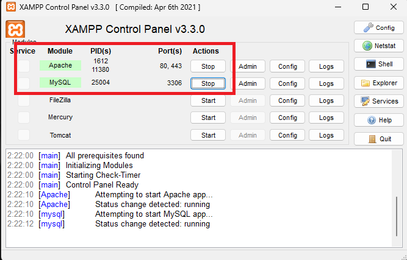
///caption
Рисунок 1 - Запуск программы 
///

3. Откройте в браузере:

   * `http://localhost/phpmyadmin`


///caption
Рисунок 2 - Phpmyadmin 
///

---

#### 2.2.2. Создание базы данных

1. В phpMyAdmin откройте вкладку **Базы данных**.
2. В поле **Создать базу данных** введите имя, например: `korochki`.
3. Выберите кодировку **utf8mb4_general_ci**.
4. Нажмите **Создать**.


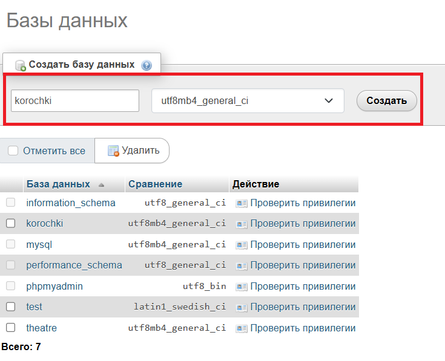
///caption
Рисунок 3 - Создание базы данных 
///

---

#### 2.2.3. Проектирование минимальных сущностей (по схеме БД)

По заданию используются основные сущности и справочники (3НФ):

* **Пользователи** `users` — регистрация/авторизация.
* **Заявки** `applications` — создание и хранение заявок пользователя.
* **Справочники**:

    * `roles` — роли пользователей (user/admin);
    * `payment_methods` — способы оплаты;
    * `application_statuses` — статусы заявок.

* **Отзывы** `reviews` — хранение отзывов пользователей.

---

#### 2.2.4. Создание таблицы ролей (roles)

1. Откройте базу `korochki`.
2. Нажмите **Создать таблицу**.
3. Имя таблицы: `roles`, количество столбцов: **2** → **Вперёд**.

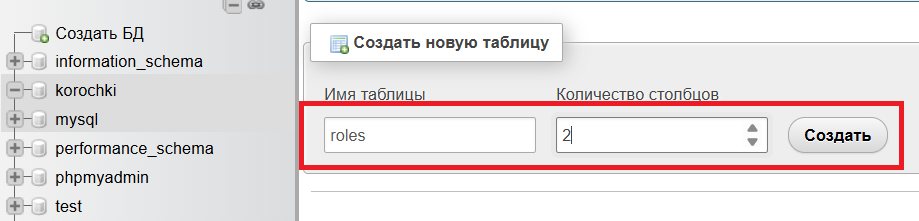
///caption
Рисунок 4 - Создание таблицы ролей
///

4. Создайте поля:

| Поле   | Тип         | Атрибуты                    |
| ------ | ----------- | --------------------------- |
| `id`   | INT         | PRIMARY KEY, AUTO_INCREMENT |
| `name` | VARCHAR(30) | NOT NULL, UNIQUE            |

5. Нажмите **Сохранить**.


///caption
Рисунок 5 - Создание полей
///

---

#### 2.2.5. Создание таблицы пользователей (users)

1. В базе `korochki` нажмите **Создать таблицу**.
2. Имя таблицы: `users`, количество столбцов: **8** → **Вперёд**.
3. Создайте поля:

| Поле            | Тип          | Атрибуты                    |
| --------------- | ------------ | --------------------------- |
| `id`            | INT          | PRIMARY KEY, AUTO_INCREMENT |
| `login`         | VARCHAR(50)  | NOT NULL, UNIQUE            |
| `password_hash` | VARCHAR(255) | NOT NULL                    |
| `full_name`     | VARCHAR(200) | NOT NULL                    |
| `phone`         | VARCHAR(20)  | NOT NULL                    |
| `email`         | VARCHAR(120) | NOT NULL, UNIQUE            |
| `role_id`       | INT          | NOT NULL                    |
| `created_at`    | TIMESTAMP    | DEFAULT CURRENT_TIMESTAMP   |

4. Нажмите **Сохранить**.


///caption
Рисунок 6 - Создание таблицы пользователей
///

---

#### 2.2.6. Создание таблицы способов оплаты (payment_methods)

1. В базе `korochki` нажмите **Создать таблицу**.
2. Имя таблицы: `payment_methods`, количество столбцов: **2** → **Вперёд**.
3. Создайте поля:

| Поле   | Тип         | Атрибуты                    |
| ------ | ----------- | --------------------------- |
| `id`   | INT         | PRIMARY KEY, AUTO_INCREMENT |
| `name` | VARCHAR(50) | NOT NULL, UNIQUE            |

4. Нажмите **Сохранить**.

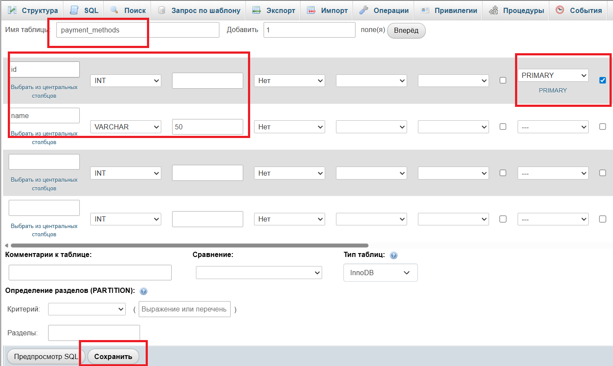
///caption
Рисунок 7 - Создание таблицы способов оплаты
///

---

#### 2.2.7. Создание таблицы статусов заявок (application_statuses)

1. В базе `korochki` нажмите **Создать таблицу**.
2. Имя таблицы: `application_statuses`, количество столбцов: **2** → **Вперёд**.
3. Создайте поля:

| Поле   | Тип         | Атрибуты                    |
| ------ | ----------- | --------------------------- |
| `id`   | INT         | PRIMARY KEY, AUTO_INCREMENT |
| `name` | VARCHAR(50) | NOT NULL, UNIQUE            |

4. Нажмите **Сохранить**.


///caption
Рисунок 8 - Создание таблицы статусов заявок
///

---

#### 2.2.8. Создание таблицы заявок (applications)

1. В базе `korochki` нажмите **Создать таблицу**.
2. Имя таблицы: `applications`, количество столбцов: **7** → **Вперёд**.
3. Создайте поля:

| Поле                | Тип          | Атрибуты                    |
| ------------------- | ------------ | --------------------------- |
| `id`                | INT          | PRIMARY KEY, AUTO_INCREMENT |
| `user_id`           | INT          | NOT NULL                    |
| `course_name`       | VARCHAR(200) | NOT NULL                    |
| `start_date`        | DATE         | NOT NULL                    |
| `payment_method_id` | INT          | NOT NULL                    |
| `status_id`         | INT          | NOT NULL                    |
| `created_at`        | TIMESTAMP    | DEFAULT CURRENT_TIMESTAMP   |

4. Нажмите **Сохранить**.

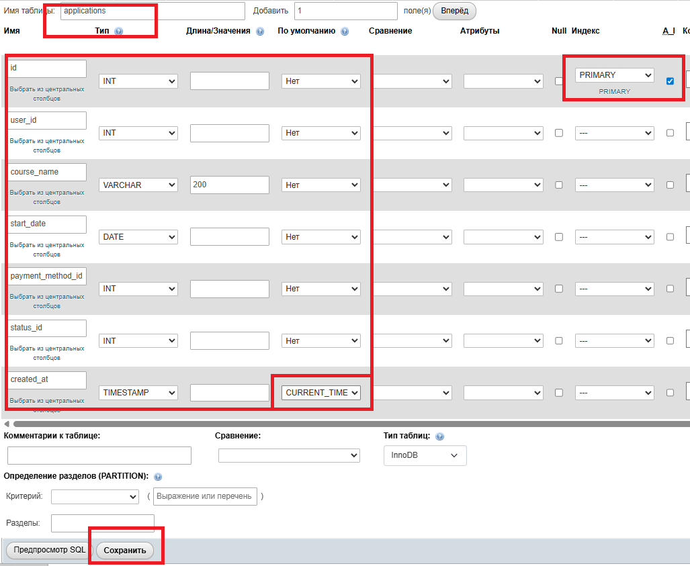
///caption
Рисунок 9 - Создание таблицы заявок
///

---

#### 2.2.9. Создание таблицы отзывов (reviews)

1. В базе `korochki` нажмите **Создать таблицу**.
2. Имя таблицы: `reviews`, количество столбцов: **4** → **Вперёд**.
3. Создайте поля:

| Поле         | Тип       | Атрибуты                    |
| ------------ | --------- | --------------------------- |
| `id`         | INT       | PRIMARY KEY, AUTO_INCREMENT |
| `user_id`    | INT       | NOT NULL                    |
| `text`       | TEXT      | NOT NULL                    |
| `created_at` | TIMESTAMP | DEFAULT CURRENT_TIMESTAMP   |

4. Нажмите **Сохранить**.


///caption
Рисунок 10 - Создание таблицы отзывов
///

---

#### 2.2.10. Создание связей (FK) между таблицами

1. Откройте таблицу `users` → вкладка **Структура** → **Связи (Relation view)**:


///caption
Рисунок 11 - Структура** → **Связи (Relation view)
///


   * поле `role_id`:

     * **Таблица:** `roles`
     * **Поле:** `id`
   * Действия:

     * ON DELETE: `RESTRICT`
     * ON UPDATE: `CASCADE`


///caption
Рисунок 12 - Выставление настроек в таблице users
///


2. Откройте таблицу `applications` → **Связи (Relation view)**:

   * поле `user_id`:

     * **Таблица:** `users`
     * **Поле:** `id`
     * ON DELETE: `CASCADE`
     * ON UPDATE: `CASCADE`

   * поле `payment_method_id`:

     * **Таблица:** `payment_methods`
     * **Поле:** `id`
     * ON DELETE: `RESTRICT`
     * ON UPDATE: `CASCADE`

   * поле `status_id`:

     * **Таблица:** `application_statuses`
     * **Поле:** `id`
     * ON DELETE: `RESTRICT`
     * ON UPDATE: `CASCADE`

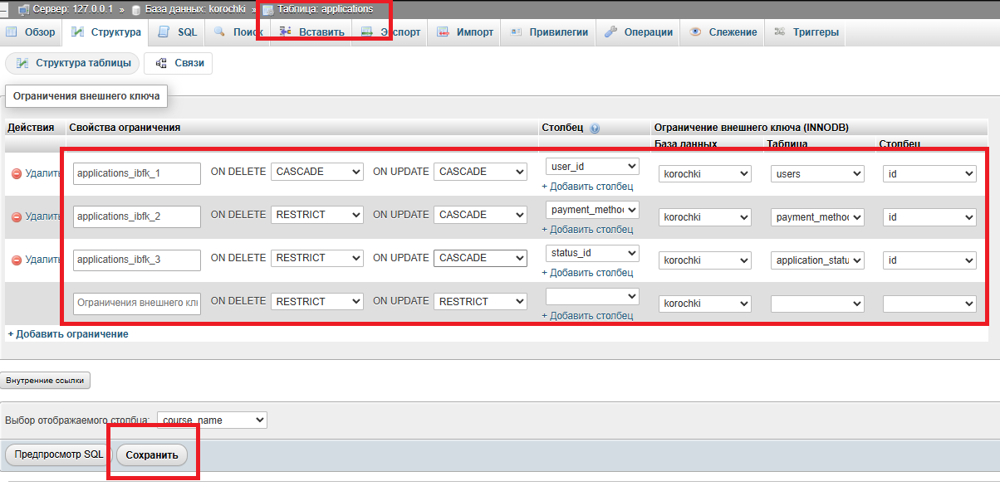
///caption
Рисунок 13 - Выставление настроек в таблице applications
///


3. Откройте таблицу `reviews` → **Связи (Relation view)**:

   * поле `user_id`:

     * **Таблица:** `users`
     * **Поле:** `id`
     * ON DELETE: `CASCADE`
     * ON UPDATE: `CASCADE`


///caption
Рисунок 14 - Выставление настроек в таблице reviews
///

>Не забудьте внести тестовые данные, чтобы можно было попробовать работу БД

---

#### 2.2.11. Создание ER-диаграммы средствами СУБД

1. В phpMyAdmin откройте базу данных `korochki`.
2. Перейдите на вкладку **Designer (Конструктор/Дизайнер)**.


///caption
Рисунок 15 - Создание ER-диаграммы средствами СУБД
///

3. Убедитесь, что на схеме отображаются таблицы:

    * `roles` → `users`
    * `users` → `applications`
    * `payment_methods` → `applications`
    * `application_statuses` → `applications`
    * `users` → `reviews`

4. Сохраните результат:

   * сделайте **скриншот** диаграммы
     или
   * экспортируйте схему, если доступно.

##### Вариант 1. Скриншот ER-диаграммы (рекомендуется)

5. Отмасштабируйте диаграмму так, чтобы **все таблицы и связи были видны на экране**.

6. Выполните скриншот экрана:

    * **Windows:** `Win + Shift + S` → выделить область с диаграммой;
    * **macOS:** `Cmd + Shift + 4` → выделить область;
    * **Linux:** стандартное средство создания снимков экрана.

7. Сохраните изображение:

    * формат: `PNG` или `JPG`;
    * рекомендуемое имя файла:
        `er-diagram-korochki.png`.

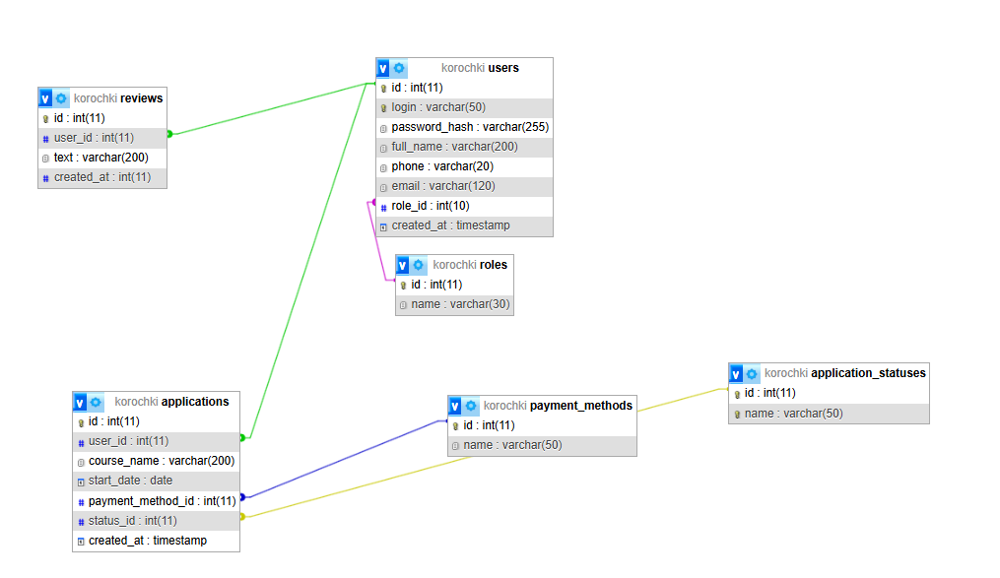
///caption
Рисунок 16 - Скриншот ER-диаграммы
///

##### Вариант 2. Экспорт схемы (если доступно)

1. В режиме **Designer** нажмите кнопку **Export / Экспорт** (если она доступна в вашей версии phpMyAdmin).

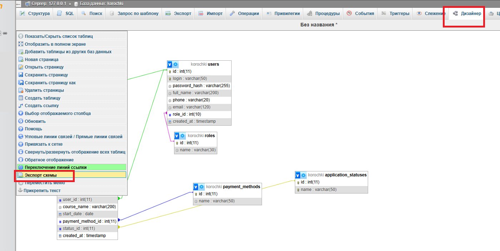
///caption
Рисунок 17 - Экспорт схемы
///

2. Выберите формат экспорта (обычно `PNG` или `PDF`).

3. Сохраните файл с именем, например:
    `er-diagram-korochki.pdf`.


    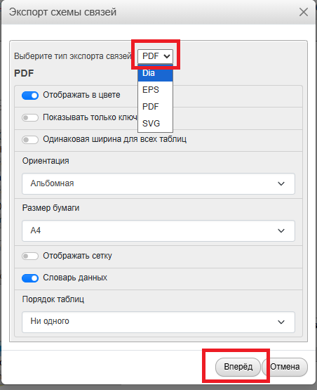
    ///caption
    Рисунок 18 - Выберите формат экспорта
    ///

---

##### Проверка результата

1. Откройте сохранённый файл и убедитесь, что:

    * видны названия всех таблиц;
    * видны поля с ключами (PK, FK);
    * отображены линии связей между таблицами.


    <iframe
    src="../assets/files//korochki.pdf"
    width="100%"
    height="800px">
    </iframe>

    👉 [Скачать пример экспорта](../assets/files//korochki.pdf)

2. Добавьте файл со скриншотом или экспортом ER-диаграммы в репозиторий проекта (папка `db/`) и зафиксируйте изменения коммитом.

---

#### 2.2.13. Создание SQL-дампа базы данных в phpMyAdmin

1. Откройте **phpMyAdmin** в браузере
   (обычно: `http://localhost/phpmyadmin`).

2. В левой панели выберите базу данных **`korochki`**.

3. В верхнем меню перейдите на вкладку **Экспорт**.


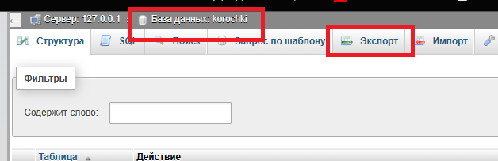
///caption
Рисунок 19 - Создание SQL-дампа базы данных в phpMyAdmin
///

---

##### Настройки экспорта (рекомендуемый вариант)

4. В разделе **Метод экспорта** выберите:

    * **Быстро**.

5. В разделе **Формат** выберите:

    * **SQL**.

6. Убедитесь, что опция **Экспорт структуры и данных** включена
   (при выборе «Быстро» она активна по умолчанию).

##### Выполнение экспорта

1. Нажмите кнопку **Экспорт** (или **Вперёд** — в зависимости от версии phpMyAdmin).

2. Браузер автоматически предложит сохранить файл.

3. Сохраните файл:

    * формат: `.sql`;
    * рекомендуемое имя файла:
        `korochki.sql`.

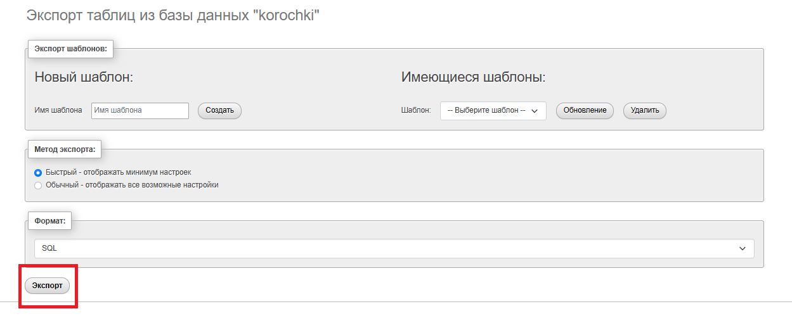
///caption
Рисунок 20 - Выполнение экспорта
///

👉 [Скачать пример экспорта](../assets/files//korochki.sql)

##### Проверка дампа

1. Откройте сохранённый файл `korochki.sql` в текстовом редакторе.

2. Убедитесь, что файл содержит:

    * команду `CREATE DATABASE korochki`;
    * команды `CREATE TABLE` для всех таблиц;
    * команды `INSERT INTO` для справочников и тестовых данных (если есть).


##### Использование SQL-дампа

1. Для восстановления базы данных:

    * откройте phpMyAdmin;
    * создайте (или выберите) базу данных;
    * перейдите на вкладку **Импорт**;
    * выберите файл `korochki.sql`;
    * нажмите **Вперёд**.


---

##### Сдача работы

1. Добавьте файл `korochki.sql` в репозиторий проекта
    (рекомендуемая папка: `db/`).

2. Зафиксируйте изменения коммитом.

---

#### 2.2.14. Файлы, которые должны быть сохранены как результат пункта 2.1

**Скриншот/экспорт **ER-диаграммы**

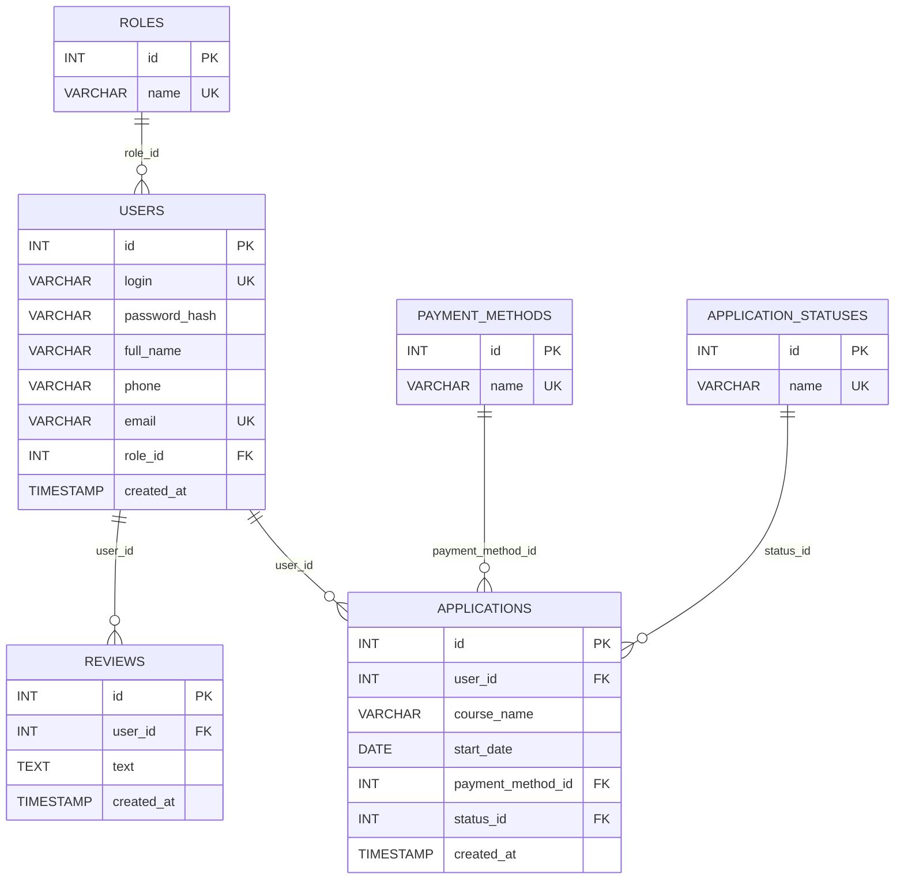

///caption
Рисунок 20 - Пример диаграммы созданной через mermaid
///


**Пример дампа базы**

```sql

DROP DATABASE IF EXISTS korochki;
CREATE DATABASE korochki CHARACTER SET utf8mb4 COLLATE utf8mb4_general_ci;
USE korochki;

-- 1) Роли (таблица-справочник)
CREATE TABLE roles (
  id   INT AUTO_INCREMENT PRIMARY KEY,
  name VARCHAR(30) NOT NULL UNIQUE
) ENGINE=InnoDB;

-- 2) Пользователи (role_id -> roles.id)
CREATE TABLE users (
  id            INT AUTO_INCREMENT PRIMARY KEY,
  login         VARCHAR(50)  NOT NULL UNIQUE,
  password_hash VARCHAR(255) NOT NULL,
  full_name     VARCHAR(200) NOT NULL,
  phone         VARCHAR(20)  NOT NULL,
  email         VARCHAR(120) NOT NULL UNIQUE,
  role_id       INT NOT NULL,
  created_at    TIMESTAMP NOT NULL DEFAULT CURRENT_TIMESTAMP,
  CONSTRAINT fk_users_role
    FOREIGN KEY (role_id) REFERENCES roles(id)
    ON UPDATE CASCADE
    ON DELETE RESTRICT
) ENGINE=InnoDB;

-- 3) Способы оплаты (таблица-справочник)
CREATE TABLE payment_methods (
  id   INT AUTO_INCREMENT PRIMARY KEY,
  name VARCHAR(50) NOT NULL UNIQUE
) ENGINE=InnoDB;

-- 4) Статусы заявок (таблица-справочник)
CREATE TABLE application_statuses (
  id   INT AUTO_INCREMENT PRIMARY KEY,
  name VARCHAR(50) NOT NULL UNIQUE
) ENGINE=InnoDB;

-- 5) Заявки (payment_method_id -> payment_methods.id, status_id -> application_statuses.id)
CREATE TABLE applications (
  id                INT AUTO_INCREMENT PRIMARY KEY,
  user_id           INT NOT NULL,
  course_name       VARCHAR(200) NOT NULL,
  start_date        DATE NOT NULL,
  payment_method_id INT NOT NULL,
  status_id         INT NOT NULL,
  created_at        TIMESTAMP NOT NULL DEFAULT CURRENT_TIMESTAMP,

  CONSTRAINT fk_app_user
    FOREIGN KEY (user_id) REFERENCES users(id)
    ON UPDATE CASCADE
    ON DELETE CASCADE,

  CONSTRAINT fk_app_payment
    FOREIGN KEY (payment_method_id) REFERENCES payment_methods(id)
    ON UPDATE CASCADE
    ON DELETE RESTRICT,

  CONSTRAINT fk_app_status
    FOREIGN KEY (status_id) REFERENCES application_statuses(id)
    ON UPDATE CASCADE
    ON DELETE RESTRICT
) ENGINE=InnoDB;

-- 6) Отзывы
CREATE TABLE reviews (
  id         INT AUTO_INCREMENT PRIMARY KEY,
  user_id    INT NOT NULL,
  text       TEXT NOT NULL,
  created_at TIMESTAMP NOT NULL DEFAULT CURRENT_TIMESTAMP,
  CONSTRAINT fk_reviews_user
    FOREIGN KEY (user_id) REFERENCES users(id)
    ON UPDATE CASCADE
    ON DELETE CASCADE
) ENGINE=InnoDB;

-- Заполнение справочников под задание
INSERT INTO roles (name) VALUES ('user'), ('admin');

INSERT INTO payment_methods (name) VALUES
  ('Наличными'),
  ('Переводом по номеру телефона');

INSERT INTO application_statuses (name) VALUES
  ('Новая'),
  ('Идёт обучение'),
  ('Обучение завершено');

-- Администратор по заданию (пароль хранить хэшем; здесь заглушка)
INSERT INTO users (login, password_hash, full_name, phone, email, role_id)
VALUES (
  'Admin',
  'KorokNET',
  'Администратор',
  '8(000)000-00-00',
  'admin@korochki.local',
  (SELECT id FROM roles WHERE name='admin')
);
```

---


## 3. Реализация минимального интерфейса (полный стек)

Сделать приложение с использованием:

- фронтенд;
- бэкенд;
- база данных;
- ООП;
- подключаемые библиотеки/фреймворки.

---

### 3.1. Cтраница регистрации

#### 3.1.1. Описание страницы регистрации

Реализовать форму с обязательными полями:

* логин — латиница и цифры, не менее 6 символов;
* пароль — не менее 8 символов;
* ФИО — символы кириллицы и пробелы;
* телефон — формат `8(XXX)XXX-XX-XX`;
* email — формат электронной почты.

Кнопка **«Создать пользователя»**:

* по нажатию данные **заносятся в базу данных**.

#### 3.1.2. Инструкция по созданию страницы frontend
##### Структура (минимум)

Создайте в проекте папку:

* `frontend/`

  * `register.html`

##### Файл `frontend/register.html`

Содержит форму и встроенную валидацию (HTML5 + JS).
Валидация по заданию: логин, пароль, ФИО (кириллица), телефон по маске, email.

```html
<!doctype html>
<html lang="ru">
<head>
  <meta charset="utf-8" />
  <meta name="viewport" content="width=device-width, initial-scale=1" />
  <title>Регистрация — Корочки.есть</title>
</head>
<body>
  <h1>Регистрация</h1>

  <form id="regForm">
    <div>
      <label>Логин</label><br />
      <input
        name="login"
        type="text"
        required
        minlength="4"
        pattern="^[A-Za-z0-9]{4,}$"
        placeholder="Латиница"
      />
    </div>

    <div>
      <label>Пароль</label><br />
      <input
        name="password"
        type="password"
        required
        minlength="8"
        placeholder="Минимум 8 символов"
      />
    </div>

    <div>
      <label>ФИО</label><br />
      <input
        name="full_name"
        type="text"
        required
        pattern="^[А-Яа-яЁё\s]+$"
        placeholder="Кириллица и пробелы"
      />
    </div>

    <div>
      <label>Телефон</label><br />
      <input
        name="phone"
        type="text"
        required
        pattern="^8\(\d{3}\)\d{3}-\d{2}-\d{2}$"
        placeholder="8(XXX)XXX-XX-XX"
      />
    </div>

    <div>
      <label>Email</label><br />
      <input
        name="email"
        type="email"
        required
        placeholder="name@example.com"
      />
    </div>

    <br />
    <button type="submit">Создать пользователя</button>
  </form>

  <p id="msg" style="white-space: pre-line;"></p>

  <script>
    const form = document.getElementById("regForm");
    const msg = document.getElementById("msg");

    form.addEventListener("submit", async (e) => {
      e.preventDefault();
      msg.textContent = "";

      // HTML5-проверка pattern/minlength/required
      if (!form.checkValidity()) {
        msg.textContent = "Проверьте корректность заполнения полей.";
        return;
      }

      const data = {
        login: form.login.value.trim(),
        password: form.password.value,
        full_name: form.full_name.value.trim(),
        phone: form.phone.value.trim(),
        email: form.email.value.trim(),
      };

      try {
        const res = await fetch("http://127.0.0.1:5000/api/register", {
          method: "POST",
          headers: { "Content-Type": "application/json" },
          body: JSON.stringify(data),
        });

        const json = await res.json().catch(() => ({}));

        if (!res.ok) {
          msg.textContent = json.error || "Ошибка регистрации.";
          return;
        }

        msg.textContent = "Пользователь создан.";
        form.reset();
      } catch (err) {
        msg.textContent = "Не удалось подключиться к серверу.";
      }
    });
  </script>
</body>
</html>
```

#### 3.1.3. Инструкция по созданию страницы backend
##### Структура

Создайте:

* `backend/`

  * `app.py`

##### Установка библиотек (один раз)

В терминале (в папке проекта/вирт.окружении):

```bash
pip install flask flask-cors pymysql
```

##### `backend/app.py`

Здесь: валидация по тем же правилам + вставка в таблицу `users`.

```python
from flask import Flask, request, jsonify, send_from_directory
import os
from flask_cors import CORS
import re
import pymysql
import hashlib

app = Flask(__name__)
CORS(app)

# ====== Настройки MySQL (XAMPP) ======
DB_CONFIG = {
    "host": "127.0.0.1",
    "user": "root",
    "password": "",       # в XAMPP часто пустой пароль
    "database": "korochki",
    "charset": "utf8mb4",
    "cursorclass": pymysql.cursors.DictCursor
}

# ====== Регулярные выражения под задание ======
RE_LOGIN = re.compile(r"^[A-Za-z]{4,}$")
RE_FULL_NAME = re.compile(r"^[А-Яа-яЁё\s]+$")
RE_PHONE = re.compile(r"^8\(\d{3}\)\d{3}-\d{2}-\d{2}$")
RE_EMAIL = re.compile(r"^[^@\s]+@[^@\s]+\.[^@\s]+$")

def hash_password(password: str) -> str:
    # Минимально: sha256 (для учебной задачи достаточно)
    return hashlib.sha256(password.encode("utf-8")).hexdigest()

def db_conn():
    return pymysql.connect(**DB_CONFIG)
@app.get("/")
def home():
    return "API is running", 200

@app.get("/register")
def register_page():
    return send_from_directory(FRONTEND_DIR, "register.html")

@app.post("/api/register")
def register():
    data = request.get_json(silent=True) or {}

    login = (data.get("login") or "").strip()
    password = data.get("password") or ""
    full_name = (data.get("full_name") or "").strip()
    phone = (data.get("phone") or "").strip()
    email = (data.get("email") or "").strip()

    # --- Обязательность полей ---
    if not all([login, password, full_name, phone, email]):
        return jsonify({"error": "Все поля обязательны для заполнения."}), 400

    # --- Валидация по заданию ---
    if not RE_LOGIN.match(login):
        return jsonify({"error": "Логин: латиница, не менее 4 символов."}), 400

    if len(password) < 8:
        return jsonify({"error": "Пароль: не менее 8 символов."}), 400

    if not RE_FULL_NAME.match(full_name):
        return jsonify({"error": "ФИО: только кириллица и пробелы."}), 400

    if not RE_PHONE.match(phone):
        return jsonify({"error": "Телефон: формат 8(XXX)XXX-XX-XX."}), 400

    if not RE_EMAIL.match(email):
        return jsonify({"error": "Email: неверный формат."}), 400

    password_hash = hash_password(password)

    # --- Запись в БД ---
    try:
        conn = db_conn()
        with conn:
            with conn.cursor() as cur:
                # проверка уникальности логина/email
                cur.execute("SELECT id FROM users WHERE login=%s OR email=%s", (login, email))
                exists = cur.fetchone()
                if exists:
                    return jsonify({"error": "Пользователь с таким логином или email уже существует."}), 409

                # role_id = роль 'user'
                cur.execute("SELECT id FROM roles WHERE name='user'")
                role = cur.fetchone()
                if not role:
                    return jsonify({"error": "В БД отсутствует роль 'user'."}), 500

                cur.execute(
                    """
                    INSERT INTO users (login, password_hash, full_name, phone, email, role_id)
                    VALUES (%s, %s, %s, %s, %s, %s)
                    """,
                    (login, password_hash, full_name, phone, email, role["id"])
                )
            conn.commit()

        return jsonify({"message": "Пользователь создан."}), 201

    except Exception:
        return jsonify({"error": "Ошибка сервера или базы данных."}), 500

if __name__ == "__main__":
    app.run(host="127.0.0.1", port=5000, debug=True)
```

#### 3.1.4. Инструкция по проверке результата 

##### Запустить сервер

```bash
python backend/app.py
```

##### Открыть страницу регистрации

Откройте `http://127.0.0.1:5000/register` в браузере.

##### Проверить запись в БД

В phpMyAdmin откройте таблицу `users` и убедитесь, что добавилась новая запись.

---

### 3.2. Страница авторизации

#### 3.2.1. Описание страницы авторизации 

1. Форма ввода логина и пароля.
2. При неверном вводе — выводить сообщения об ошибке.
3. Переходы между страницами:
    * на авторизации: **«Еще не зарегистрированы? Регистрация»**
    * на регистрации: обратный переход на авторизацию.

#### 3.2.2. Инструкция по созданию страницы frontend
 
##### Структура (минимум)

Создайте в проекте папку:

* `frontend/`

  * `login.html`

##### Файл `frontend/login.html`
Форма логин/пароль, сообщения об ошибке, ссылка на регистрацию.

```html
<!doctype html>
<html lang="ru">
<head>
  <meta charset="utf-8" />
  <meta name="viewport" content="width=device-width, initial-scale=1" />
  <title>Авторизация — Корочки.есть</title>
<link rel="stylesheet" href="/styles.css">
</head>
<body>
  <h1>Авторизация</h1>

  <form id="loginForm">
    <div>
      <label>Логин</label><br />
      <input
        name="login"
        type="text"
        required
        minlength="4"
        pattern="^[A-Za-z0-9]{4,}$"
        placeholder="Латиница"
      />
    </div>

    <div>
      <label>Пароль</label><br />
      <input
        name="password"
        type="password"
        required
        minlength="8"
        placeholder="Минимум 8 символов"
      />
    </div>

    <br />
    <button type="submit">Войти</button>
  </form>

  <p id="msg" style="white-space: pre-line;"></p>

  <p>
<a href="/register">Еще не зарегистрированы? Регистрация</a>
  </p>

  <script>
    const form = document.getElementById("loginForm");
    const msg = document.getElementById("msg");

    form.addEventListener("submit", async (e) => {
      e.preventDefault();
      msg.textContent = "";

      if (!form.checkValidity()) {
        msg.textContent = "Проверьте корректность логина и пароля.";
        return;
      }

      const data = {
        login: form.login.value.trim(),
        password: form.password.value
      };

      try {
        const res = await fetch("http://127.0.0.1:5000/api/login", {
          method: "POST",
          headers: { "Content-Type": "application/json" },
          body: JSON.stringify(data)
        });

        const json = await res.json().catch(() => ({}));

        if (!res.ok) {
          msg.textContent = json.error || "Неверный логин или пароль.";
          return;
        }

        // Минимально: сохранить признак входа (для следующих страниц)
        localStorage.setItem("user_id", String(json.user_id));
        localStorage.setItem("role", json.role);

        msg.textContent = "Вход выполнен.";

        // Переход дальше сделаем на следующем этапе (страница заявок/админ)
        // window.location.href = "./applications.html";
      } catch {
        msg.textContent = "Не удалось подключиться к серверу.";
      }
    });
  </script>
</body>
</html>

```
##### Добавить ссылку в `frontend/register.html`

В конец страницы регистрации добавьте:

```html
  <p>
<a href="/login">Уже зарегистрированы? Войти</a>
  </p>

```

#### 3.2.3. Инструкция по созданию страницы backend

##### Добавить в `backend/app.py` обработчик `/api/login`

Делаем модификацию для путей:

```python
@app.get("/")
def root():
    # по умолчанию открываем авторизацию
    return send_from_directory(FRONTEND_DIR, "login.html")

@app.get("/login")
def login_page():
    return send_from_directory(FRONTEND_DIR, "login.html")

@app.get("/register")
def register_page():
    return send_from_directory(FRONTEND_DIR, "register.html")
```

Вставьте этот код **в тот же файл**, где уже есть `/api/register` (после него).

```python
@app.post("/api/login")
def login():
    data = request.get_json(silent=True) or {}

    login_value = (data.get("login") or "").strip()
    password = data.get("password") or ""

    if not login_value or not password:
        return jsonify({"error": "Введите логин и пароль."}), 400

    # (необязательно, но совпадает с требованиями формата логина)
    if not RE_LOGIN.match(login_value):
        return jsonify({"error": "Неверный формат логина."}), 400

    password_hash = hash_password(password)

    try:
        conn = db_conn()
        with conn:
            with conn.cursor() as cur:
                cur.execute(
                    """
                    SELECT u.id, r.name AS role, u.password_hash
                    FROM users u
                    JOIN roles r ON r.id = u.role_id
                    WHERE u.login = %s
                    """,
                    (login_value,)
                )
                user = cur.fetchone()

                if not user:
                    return jsonify({"error": "Неверный логин или пароль."}), 401

                if user["password_hash"] != password_hash:
                    return jsonify({"error": "Неверный логин или пароль."}), 401

        return jsonify({
            "message": "Вход выполнен.",
            "user_id": user["id"],
            "role": user["role"]
        }), 200

    except Exception:
        return jsonify({"error": "Ошибка сервера или базы данных."}), 500
```

#### 3.2.4. Инструкция по проверке результата 

##### Запустить сервер

```bash
python backend/app.py
```

##### Открыть страницу авторизации 

Откройте `http://127.0.0.1:5000/login` в браузере или перейдите через фразу Уже зарегистрированы? Войти. 

##### Проверить страницу 

* пустые поля → сообщение “Введите логин и пароль”
* неверные данные → “Неверный логин или пароль”
* верные данные → “Вход выполнен.”

##### Проверить переходы:

* на `login.html` есть ссылка **«Еще не зарегистрированы? Регистрация»**
* на `register.html` есть ссылка **«Уже зарегистрированы? Войти»**

---

### 3.3. Страница просмотра заявок

#### 3.3.1. Описание страницы заявок 

Для авторизованного пользователя:

   * просмотр ранее оставленных заявок;
   * возможность оставить отзыв о качестве образовательных услуг.

#### 3.3.2. Инструкция по созданию страницы frontend

##### Структура (минимум)

Создайте в проекте папку:

* `frontend/`

  * `applications.html`

##### Файл `frontend/applications.html`

Функции по заданию:

* показать ранее оставленные заявки авторизованного пользователя
* оставить отзыв

```html
<!doctype html>
<html lang="ru">
<head>
  <meta charset="utf-8" />
  <meta name="viewport" content="width=device-width, initial-scale=1" />
  <title>Мои заявки — Корочки.есть</title>
</head>
<body>
  <h1>Мои заявки</h1>

  <div id="authWarn" style="display:none;">
    <p>Требуется авторизация.</p>
    <a href="./login.html">Перейти к авторизации</a>
  </div>

  <div id="content" style="display:none;">
    <h2>Список заявок</h2>
    <table border="1" cellpadding="6" cellspacing="0">
      <thead>
        <tr>
          <th>ID</th>
          <th>Курс</th>
          <th>Дата начала</th>
          <th>Оплата</th>
          <th>Статус</th>
          <th>Дата создания</th>
        </tr>
      </thead>
      <tbody id="appsTbody"></tbody>
    </table>

    <h2>Оставить отзыв</h2>
    <form id="reviewForm">
      <textarea name="text" rows="5" cols="60" required placeholder="Введите отзыв"></textarea>
      <br /><br />
      <button type="submit">Отправить отзыв</button>
    </form>

    <p id="msg" style="white-space: pre-line;"></p>
  </div>

  <script>
    const userId = localStorage.getItem("user_id");
    const authWarn = document.getElementById("authWarn");
    const content = document.getElementById("content");
    const msg = document.getElementById("msg");
    const tbody = document.getElementById("appsTbody");
    const reviewForm = document.getElementById("reviewForm");

    function renderApps(apps) {
      tbody.innerHTML = "";
      if (!apps || apps.length === 0) {
        const tr = document.createElement("tr");
        tr.innerHTML = `<td colspan="6">Заявок нет</td>`;
        tbody.appendChild(tr);
        return;
      }

      for (const a of apps) {
        const tr = document.createElement("tr");
        tr.innerHTML = `
          <td>${a.id}</td>
          <td>${a.course_name}</td>
          <td>${a.start_date}</td>
          <td>${a.payment_method}</td>
          <td>${a.status}</td>
          <td>${a.created_at}</td>
        `;
        tbody.appendChild(tr);
      }
    }

    async function loadMyApps() {
      msg.textContent = "";
      try {
        const res = await fetch(`http://127.0.0.1:5000/api/applications/my?user_id=${encodeURIComponent(userId)}`);
        const json = await res.json().catch(() => ({}));
        if (!res.ok) {
          msg.textContent = json.error || "Ошибка получения заявок.";
          return;
        }
        renderApps(json.applications);
      } catch {
        msg.textContent = "Не удалось подключиться к серверу.";
      }
    }

    reviewForm.addEventListener("submit", async (e) => {
      e.preventDefault();
      msg.textContent = "";

      const text = reviewForm.text.value.trim();
      if (!text) {
        msg.textContent = "Введите текст отзыва.";
        return;
      }

      try {
        const res = await fetch("http://127.0.0.1:5000/api/reviews", {
          method: "POST",
          headers: { "Content-Type": "application/json" },
          body: JSON.stringify({ user_id: Number(userId), text })
        });

        const json = await res.json().catch(() => ({}));
        if (!res.ok) {
          msg.textContent = json.error || "Ошибка отправки отзыва.";
          return;
        }

        msg.textContent = "Отзыв отправлен.";
        reviewForm.reset();
      } catch {
        msg.textContent = "Не удалось подключиться к серверу.";
      }
    });

    // Проверка авторизации
    if (!userId) {
      authWarn.style.display = "block";
    } else {
      content.style.display = "block";
      loadMyApps();
    }
  </script>
</body>
</html>
```

#### 3.3.3. Инструкция по созданию страницы backend

##### Дополнить марштуры 
```python
  @app.get("/applications")
  def applications_page():
      return send_from_directory(FRONTEND_DIR, "applications.html")
```

##### Добавить эндпоинт получения заявок пользователя в `backend/app.py`

```python
@app.get("/api/applications/my")
def my_applications():
    user_id = request.args.get("user_id", "").strip()

    if not user_id.isdigit():
        return jsonify({"error": "Требуется корректный user_id."}), 400

    try:
        conn = db_conn()
        with conn:
            with conn.cursor() as cur:
                cur.execute(
                    """
                    SELECT
                      a.id,
                      a.course_name,
                      DATE_FORMAT(a.start_date, '%%Y-%%m-%%d') AS start_date,
                      pm.name AS payment_method,
                      st.name AS status,
                      DATE_FORMAT(a.created_at, '%%Y-%%m-%%d %%H:%%i:%%s') AS created_at
                    FROM applications a
                    JOIN payment_methods pm ON pm.id = a.payment_method_id
                    JOIN application_statuses st ON st.id = a.status_id
                    WHERE a.user_id = %s
                    ORDER BY a.id DESC
                    """,
                    (int(user_id),)
                )
                apps = cur.fetchall()

        return jsonify({"applications": apps}), 200
    except Exception:
        return jsonify({"error": "Ошибка сервера или базы данных."}), 500
```

##### Добавить эндпоинт добавления отзыва в `backend/app.py`

```python
@app.post("/api/reviews")
def add_review():
    data = request.get_json(silent=True) or {}

    user_id = data.get("user_id")
    text = (data.get("text") or "").strip()

    if not isinstance(user_id, int) or user_id <= 0:
        return jsonify({"error": "Требуется корректный user_id."}), 400

    if not text:
        return jsonify({"error": "Текст отзыва обязателен."}), 400

    try:
        conn = db_conn()
        with conn:
            with conn.cursor() as cur:
                # проверим, что пользователь существует
                cur.execute("SELECT id FROM users WHERE id=%s", (user_id,))
                if not cur.fetchone():
                    return jsonify({"error": "Пользователь не найден."}), 404

                cur.execute(
                    "INSERT INTO reviews (user_id, text) VALUES (%s, %s)",
                    (user_id, text)
                )
            conn.commit()

        return jsonify({"message": "Отзыв добавлен."}), 201
    except Exception:
        return jsonify({"error": "Ошибка сервера или базы данных."}), 500
```

#### 3.3.4. Инструкция по проверке результата 

##### Запустить сервер

```bash
python backend/app.py
```
##### Открыть страницу

1. Войдите через `http://127.0.0.1:5000/login` (чтобы сохранился `user_id` в localStorage).

2. Откройте `http://127.0.0.1:5000/applications`:

* должна появиться таблица заявок пользователя (если их нет — “Заявок нет”)
* отправьте отзыв — появится сообщение “Отзыв отправлен”, запись появится в таблице `reviews` в БД

---


### 3.4. Страница формирования заявки

#### 3.4.1. Описание страницы формирования заявки

Форма заявки:

* наименование курса;
* желаемая дата начала обучения;
* способ оплаты:

    * наличными;
    * переводом по номеру телефона.

Кнопка **«Отправить»**:

* заявка направляется администратору;
* заявка сохраняется в базе данных.

#### 3.4.2. Инструкция по созданию страницы frontend

##### Файл `frontend/create_application.html`

Функции по заданию:

* ввод курса, даты, способа оплаты (2 варианта)
* кнопка **«Отправить»**: заявка сохраняется в БД (через backend)

```html
<!doctype html>
<html lang="ru">
<head>
  <meta charset="utf-8" />
  <meta name="viewport" content="width=device-width, initial-scale=1" />
  <title>Новая заявка — Корочки.есть</title>
</head>
<body>
  <h1>Формирование заявки</h1>

  <div id="authWarn" style="display:none;">
    <p>Требуется авторизация.</p>
    <a href="./login.html">Перейти к авторизации</a>
  </div>

  <div id="content" style="display:none;">
    <form id="appForm">
      <div>
        <label>Наименование курса</label><br />
        <input name="course_name" type="text" required placeholder="Введите курс" />
      </div>

      <div>
        <label>Желаемая дата начала обучения</label><br />
        <input name="start_date" type="date" required />
      </div>

      <div>
        <label>Способ оплаты</label><br />
        <label>
          <input type="radio" name="payment_method" value="Наличными" required />
          Наличными
        </label><br />
        <label>
          <input type="radio" name="payment_method" value="Переводом по номеру телефона" required />
          Переводом по номеру телефона
        </label>
      </div>

      <br />
      <button type="submit">Отправить</button>
    </form>

    <p id="msg" style="white-space: pre-line;"></p>

    <p>
      <a href="applications">Назад к заявкам</a>
    </p>
  </div>

  <script>
    const userId = localStorage.getItem("user_id");
    const authWarn = document.getElementById("authWarn");
    const content = document.getElementById("content");
    const msg = document.getElementById("msg");
    const form = document.getElementById("appForm");

    if (!userId) {
      authWarn.style.display = "block";
    } else {
      content.style.display = "block";
    }

    form.addEventListener("submit", async (e) => {
      e.preventDefault();
      msg.textContent = "";

      if (!form.checkValidity()) {
        msg.textContent = "Заполните все поля формы.";
        return;
      }

      const courseName = form.course_name.value.trim();
      const startDate = form.start_date.value;
      const paymentMethod = form.payment_method.value;

      if (!courseName) {
        msg.textContent = "Укажите наименование курса.";
        return;
      }

      const payload = {
        user_id: Number(userId),
        course_name: courseName,
        start_date: startDate,
        payment_method: paymentMethod
      };

      try {
        const res = await fetch("http://127.0.0.1:5000/api/applications", {
          method: "POST",
          headers: { "Content-Type": "application/json" },
          body: JSON.stringify(payload)
        });

        const json = await res.json().catch(() => ({}));
        if (!res.ok) {
          msg.textContent = json.error || "Ошибка отправки заявки.";
          return;
        }

        msg.textContent = "Заявка отправлена.";
        form.reset();
      } catch {
        msg.textContent = "Не удалось подключиться к серверу.";
      }
    });
  </script>
</body>
</html>
```
##### Добавим в конец `application.html`

```html
    <p>
      <a href="/create_application">Перейти к заявкам</a>
    </p>
```

#### 3.4.3. Инструкция по созданию страницы backend
##### Добавить маршутизацию

```python
@app.get("/create_application")
def create_application_page():
    return send_from_directory(FRONTEND_DIR, "create_application.html")
```

##### Добавить эндпоинт `POST /api/applications` в `backend/app.py`

Заявка:

* сохраняется в таблицу `applications`
* статус ставится **«Новая»** (через справочник `application_statuses`)
* способ оплаты берём из справочника `payment_methods`

```python
@app.post("/api/applications")
def create_application():
    data = request.get_json(silent=True) or {}

    user_id = data.get("user_id")
    course_name = (data.get("course_name") or "").strip()
    start_date = (data.get("start_date") or "").strip()  # формат YYYY-MM-DD
    payment_method_name = (data.get("payment_method") or "").strip()

    if not isinstance(user_id, int) or user_id <= 0:
        return jsonify({"error": "Требуется корректный user_id."}), 400

    if not course_name:
        return jsonify({"error": "Наименование курса обязательно."}), 400

    if not start_date:
        return jsonify({"error": "Дата начала обязательна."}), 400

    if payment_method_name not in ("Наличными", "Переводом по номеру телефона"):
        return jsonify({"error": "Выберите способ оплаты."}), 400

    try:
        conn = db_conn()
        with conn:
            with conn.cursor() as cur:
                # пользователь существует?
                cur.execute("SELECT id FROM users WHERE id=%s", (user_id,))
                if not cur.fetchone():
                    return jsonify({"error": "Пользователь не найден."}), 404

                # payment_method_id по названию
                cur.execute("SELECT id FROM payment_methods WHERE name=%s", (payment_method_name,))
                pm = cur.fetchone()
                if not pm:
                    return jsonify({"error": "Способ оплаты не найден в справочнике."}), 500

                # status_id для "Новая"
                cur.execute("SELECT id FROM application_statuses WHERE name='Новая'")
                st = cur.fetchone()
                if not st:
                    return jsonify({"error": "Статус 'Новая' не найден в справочнике."}), 500

                cur.execute(
                    """
                    INSERT INTO applications (user_id, course_name, start_date, payment_method_id, status_id)
                    VALUES (%s, %s, %s, %s, %s)
                    """,
                    (user_id, course_name, start_date, pm["id"], st["id"])
                )
            conn.commit()

        return jsonify({"message": "Заявка создана."}), 201

    except Exception:
        return jsonify({"error": "Ошибка сервера или базы данных."}), 500
```

#### 3.4.4. Инструкция по проверке результата 

##### Запустить сервер

```bash
python backend/app.py
```

##### Открыть страницу

1. Авторизоваться через `http://127.0.0.1:5000/login`.
2. Открыть `http://127.0.0.1:5000/create_application`, заполнить форму и нажать **«Отправить»**.
3. Открыть `http://127.0.0.1:5000/applications` и убедиться, что новая заявка появилась в списке.
4. В phpMyAdmin проверить таблицу `applications` — запись добавлена, статус = **«Новая»**.

---

### 3.5. Панель администратора

#### 3.5.1. Описание страницы формирования заявки

Доступ:

* логин: `Admin`
* пароль: `KorokNET`

Функции:

* отображаются **все заявки пользователей**;
* изначальный статус заявки: **«Новая»**;
* администратор может изменить статус на:

  * **«Идёт обучение»**
  * **«Обучение завершено»**

#### 3.5.2. Инструкция по созданию страницы frontend

##### Файл `frontend/admin.html`

Функции по заданию:

* показать **все заявки пользователей**
* у каждой заявки показать **статус**
* дать возможность изменить статус на:

  * **Идёт обучение**
  * **Обучение завершено**

```html
<!doctype html>
<html lang="ru">
<head>
  <meta charset="utf-8" />
  <meta name="viewport" content="width=device-width, initial-scale=1" />
  <title>Панель администратора — Корочки.есть</title>
</head>
<body>
  <h1>Панель администратора</h1>

  <div id="accessWarn" style="display:none;">
    <p>Доступ запрещён. Требуется вход под Admin.</p>
    <a href="./login.html">Перейти к авторизации</a>
  </div>

  <div id="content" style="display:none;">
    <h2>Все заявки пользователей</h2>

    <table border="1" cellpadding="6" cellspacing="0">
      <thead>
        <tr>
          <th>ID</th>
          <th>Пользователь</th>
          <th>Курс</th>
          <th>Дата начала</th>
          <th>Оплата</th>
          <th>Статус</th>
          <th>Изменить статус</th>
        </tr>
      </thead>
      <tbody id="appsTbody"></tbody>
    </table>

    <p id="msg" style="white-space: pre-line;"></p>
  </div>

  <script>
    const role = localStorage.getItem("role"); // ожидаем "admin"
    const accessWarn = document.getElementById("accessWarn");
    const content = document.getElementById("content");
    const msg = document.getElementById("msg");
    const tbody = document.getElementById("appsTbody");

    function setMessage(text) {
      msg.textContent = text || "";
    }

    function rowTemplate(app) {
      // В выпадающем списке разрешены только статусы из задания
      const options = ["Новая", "Идёт обучение", "Обучение завершено"]
        .map(s => `<option value="${s}" ${s === app.status ? "selected" : ""}>${s}</option>`)
        .join("");

      return `
        <tr>
          <td>${app.id}</td>
          <td>${app.user_login}</td>
          <td>${app.course_name}</td>
          <td>${app.start_date}</td>
          <td>${app.payment_method}</td>
          <td>${app.status}</td>
          <td>
            <select data-app-id="${app.id}">${options}</select>
            <button data-save-id="${app.id}">Сохранить</button>
          </td>
        </tr>
      `;
    }

    async function loadAllApps() {
      setMessage("");
      tbody.innerHTML = "";

      try {
        const res = await fetch("http://127.0.0.1:5000/api/admin/applications");
        const json = await res.json().catch(() => ({}));

        if (!res.ok) {
          setMessage(json.error || "Ошибка получения заявок.");
          return;
        }

        const apps = json.applications || [];
        if (apps.length === 0) {
          tbody.innerHTML = `<tr><td colspan="7">Заявок нет</td></tr>`;
          return;
        }

        tbody.innerHTML = apps.map(rowTemplate).join("");

        // Навесить обработчики на кнопки "Сохранить"
        tbody.querySelectorAll("button[data-save-id]").forEach(btn => {
          btn.addEventListener("click", async () => {
            const appId = btn.getAttribute("data-save-id");
            const select = tbody.querySelector(`select[data-app-id="${appId}"]`);
            const newStatus = select.value;

            await updateStatus(appId, newStatus);
            await loadAllApps(); // обновить таблицу после изменения
          });
        });

      } catch {
        setMessage("Не удалось подключиться к серверу.");
      }
    }

    async function updateStatus(appId, statusName) {
      setMessage("");

      try {
        const res = await fetch(`http://127.0.0.1:5000/api/admin/applications/${appId}/status`, {
          method: "PATCH",
          headers: { "Content-Type": "application/json" },
          body: JSON.stringify({ status: statusName })
        });

        const json = await res.json().catch(() => ({}));
        if (!res.ok) {
          setMessage(json.error || "Ошибка изменения статуса.");
          return;
        }

        setMessage("Статус обновлён.");
      } catch {
        setMessage("Не удалось подключиться к серверу.");
      }
    }

    // Доступ: только admin (роль сохраняется после login)
    if (role !== "admin") {
      accessWarn.style.display = "block";
    } else {
      content.style.display = "block";
      loadAllApps();
    }
  </script>
</body>
</html>
```

#### 3.5.3. Инструкция по созданию страницы backend

##### `GET /api/admin/applications` (все заявки)

Добавьте в `backend/app.py`:

```python
@app.get("/api/admin/applications")
def admin_applications():
    try:
        conn = db_conn()
        with conn:
            with conn.cursor() as cur:
                cur.execute(
                    """
                    SELECT
                      a.id,
                      u.login AS user_login,
                      a.course_name,
                      DATE_FORMAT(a.start_date, '%%Y-%%m-%%d') AS start_date,
                      pm.name AS payment_method,
                      st.name AS status
                    FROM applications a
                    JOIN users u ON u.id = a.user_id
                    JOIN payment_methods pm ON pm.id = a.payment_method_id
                    JOIN application_statuses st ON st.id = a.status_id
                    ORDER BY a.id DESC
                    """
                )
                apps = cur.fetchall()

        return jsonify({"applications": apps}), 200
    except Exception:
        return jsonify({"error": "Ошибка сервера или базы данных."}), 500
```

##### `PATCH /api/admin/applications/<id>/status` (смена статуса)

Добавьте в `backend/app.py`:

```python
@app.patch("/api/admin/applications/<int:app_id>/status")
def admin_update_status(app_id: int):
    data = request.get_json(silent=True) or {}
    status_name = (data.get("status") or "").strip()

    # По заданию админ может установить только эти статусы
    allowed = {"Идёт обучение", "Обучение завершено", "Новая"}
    if status_name not in allowed:
        return jsonify({"error": "Недопустимый статус."}), 400

    try:
        conn = db_conn()
        with conn:
            with conn.cursor() as cur:
                # получить id статуса по названию
                cur.execute("SELECT id FROM application_statuses WHERE name=%s", (status_name,))
                st = cur.fetchone()
                if not st:
                    return jsonify({"error": "Статус не найден в справочнике."}), 500

                # обновить статус заявки
                cur.execute("UPDATE applications SET status_id=%s WHERE id=%s", (st["id"], app_id))
                if cur.rowcount == 0:
                    return jsonify({"error": "Заявка не найдена."}), 404

            conn.commit()

        return jsonify({"message": "Статус обновлён."}), 200
    except Exception:
        return jsonify({"error": "Ошибка сервера или базы данных."}), 500
```

#### 3.5.4. Инструкция по проверке результата 

> Убедитесь, что в БД есть пользователь Admin (логин `Admin`, пароль `KorokNET`) и роль `admin`.

##### Исправление Admin в БД (обязательно)

Сгенерируйте sha256 для `KorokNET`:

```python
import hashlib
print(hashlib.sha256("KorokNET".encode("utf-8")).hexdigest())
```

Скопируйте результат и выполните в phpMyAdmin:

```sql
UPDATE users
SET password_hash = 'ВАШ_SHA256_ХЭШ'
WHERE login = 'Admin';
```

После этого:

1. зайдите снова под Admin,
2. проверьте в Console, что `localStorage.getItem("role")` = `"admin"`,
3. откройте `/admin`.


##### Запустить сервер

```bash
python backend/app.py
```

##### Открыть страницу
1. Откройте `http://127.0.0.1:5000/login` и войдите как:

    * логин: `Admin`
    * пароль: `KorokNET`

2. Откройте `http://127.0.0.1:5000/admin`:

    * должны отобразиться все заявки
    * у каждой заявки должен быть статус (по умолчанию “Новая”)
    * смените статус на “Идёт обучение” / “Обучение завершено” → нажмите “Сохранить” → статус обновится.
---

## 4. Настройка стилей

### Создайте файл

`frontend/styles.css`

```css
/* =========================
   Korochki.есть — base styles
   ========================= */

:root {
  --bg: #ffffff;
  --text: #222222;
  --muted: #666666;
  --border: #d7d7d7;
  --surface: #f7f7f7;
  --focus: #1a73e8;
  --danger: #b00020;
  --ok: #0b8043;
}

* { box-sizing: border-box; }

body {
  margin: 0;
  font-family: Arial, Helvetica, sans-serif;
  background: var(--bg);
  color: var(--text);
}

.container {
  max-width: 760px;
  margin: 24px auto;
  padding: 0 16px;
}

h1, h2 {
  margin: 0 0 16px 0;
  font-weight: 700;
}

h2 { margin-top: 24px; }

.card {
  background: var(--surface);
  border: 1px solid var(--border);
  border-radius: 10px;
  padding: 16px;
}

.field { margin-bottom: 12px; }

label {
  display: inline-block;
  margin-bottom: 6px;
  font-weight: 600;
}

input, textarea, select {
  width: 100%;
  padding: 10px 12px;
  border: 1px solid var(--border);
  border-radius: 8px;
  background: #fff;
  font-size: 14px;
}

textarea { resize: vertical; min-height: 110px; }

input:focus, textarea:focus, select:focus {
  outline: 2px solid var(--focus);
  outline-offset: 1px;
}

.row {
  display: grid;
  grid-template-columns: 1fr 1fr;
  gap: 12px;
}

@media (max-width: 640px) {
  .row { grid-template-columns: 1fr; }
}

.actions {
  display: flex;
  gap: 10px;
  align-items: center;
  margin-top: 14px;
}

button {
  padding: 10px 14px;
  border: 1px solid var(--border);
  border-radius: 8px;
  background: #fff;
  cursor: pointer;
  font-weight: 700;
}

button:hover { filter: brightness(0.98); }

a {
  color: var(--focus);
  text-decoration: none;
}

a:hover { text-decoration: underline; }

.msg {
  margin-top: 12px;
  white-space: pre-line;
  color: var(--muted);
}

.msg.error { color: var(--danger); }
.msg.ok { color: var(--ok); }

.table {
  width: 100%;
  border-collapse: collapse;
  margin-top: 10px;
  background: #fff;
  border: 1px solid var(--border);
  border-radius: 10px;
  overflow: hidden;
}

.table th, .table td {
  border-bottom: 1px solid var(--border);
  padding: 10px;
  text-align: left;
  font-size: 14px;
}

.table th {
  background: var(--surface);
  font-weight: 700;
}

.badge {
  display: inline-block;
  padding: 3px 8px;
  border: 1px solid var(--border);
  border-radius: 999px;
  font-size: 12px;
  background: var(--surface);
}
```

---

### Подключите CSS на каждой странице

В `<head>` добавьте:

```html
<link rel="stylesheet" href="/styles.css">
```
В `backend/app.py` добавьте пути:
```python
@app.get("/styles.css")
def styles_css():
    return send_from_directory(FRONTEND_DIR, "styles.css")
```

и в конец файла перед `if __name__ == "__main__":`
```python
@app.get("/styles.css")
def styles():
    frontend_dir = os.path.join(os.path.dirname(__file__), "..", "frontend")
    return send_from_directory(frontend_dir, "styles.css")

```

---

### Минимальные правки HTML (чтобы стиль применился красиво)

#### Обёртка страницы

Сразу после `<body>` добавьте контейнер:

```html
<div class="container">
  <!-- ваш контент -->
</div>
```

#### Сообщение

Замените:

```html
<p id="msg"></p>
```

на:

```html
<p id="msg" class="msg"></p>
```

(Если хотите различать успех/ошибку — можно добавлять `msg ok` или `msg error` в JS.)

#### Поля формы

Каждый блок поля лучше обернуть так:

```html
<div class="field">
  <label>Логин</label>
  <input ... />
</div>
```
 
---

## 5. Передача результатов

1. Все результаты загрузить в индивидуальный репозиторий (файлами).
2. Коммиты минимум:

    * в начале выполнения модуля;
    * в завершении выполнения модуля.

## 6. Пример готового приложения

Для ознакомления требуется: 

* Распаковать;
* Открыть в VS Code;
* Запустить терминал:

```python
pip install flask flask-cors pymysql
```

* Запустите сервер: 

```python
python backend/app.py
```

* Импортировать базу данных, см. в архиве папка db/korochki.sql

* Перейдите http://127.0.0.1:5000/login

| Логин | Пароль    | Роль администратора |
| ----- | --------- | ------------------- |
| Admin | KorokNET  | Администратор       |
| test  | qazqaz123 | Пользователь        |

* Попробуйте различные пути 

| HTTP-метод | Путь                  | Назначение маршрута   | Открываемая страница      | Описание                                                                                |
| ---------- | --------------------- | --------------------- | ------------------------- | --------------------------------------------------------------------------------------- |
| GET        | `/`                   | Главная страница      | `login.html`              | Начальная точка приложения. По умолчанию открывается страница авторизации пользователя. |
| GET        | `/login`              | Авторизация           | `login.html`              | Страница входа в систему для зарегистрированных пользователей.                          |
| GET        | `/register`           | Регистрация           | `register.html`           | Страница регистрации нового пользователя в системе.                                     |
| GET        | `/applications`       | Просмотр заявок       | `applications.html`       | Страница авторизованного пользователя для просмотра ранее созданных заявок и отзывов.   |
| GET        | `/create_application` | Создание заявки       | `create_application.html` | Страница формирования новой заявки на обучение.                                         |
| GET        | `/admin`              | Панель администратора | `admin.html`              | Административная панель для просмотра всех заявок и изменения их статусов.              |


👉 [Пример готового приложения](../assets/files//gdrmi-demo.zip)
