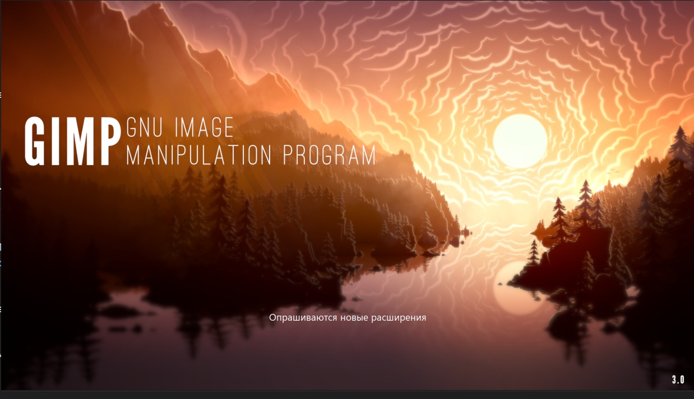
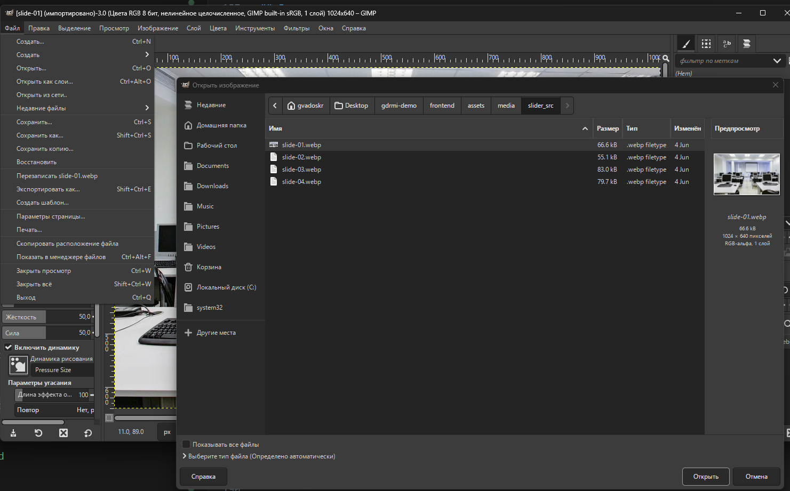
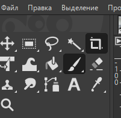
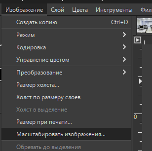
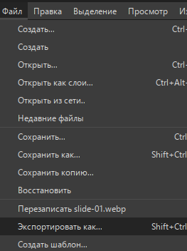

# Модуль 2. Разработка дизайна веб-приложений - Пошаговое выполнение задания
 
## 1.1. Создать папку для изображений в проекте

### 1.1.1. Создание папки

1. Открыть папку проекта.
2. Перейти в каталог `frontend/`.
3. Создать внутри `frontend` папки по цепочке:

   * `assets`
   * `media`

Итоговый путь: `frontend/assets/media/`.

### 1.1.2. Проверка результата

Убедиться, что папка создана:

* в проводнике отображается `frontend/assets/media`;
* или в терминале:

**Windows:**

```powershell
dir frontend\assets
```

**macOS/Linux:**

```bash
ls -la frontend/assets
```

---

## 1.2. Распаковать архив с изображениями

Архив: `Прил_ОЗ_КОД 09.02.07-3-2026-М2.zip`

### 1.2.1. Распаковка через проводник

1. Найти архив на компьютере.
2. Выполнить команду **Извлечь все** / **Extract**.
3. Выбрать папку для распаковки (например, `Downloads/М2`).

После распаковки должна появиться папка `media/` и внутри неё файлы изображений `image01...image18` (разные форматы).

### 1.2.2. Проверка результата

Открыть распакованную папку и убедиться:

* присутствует папка `media`;
* внутри находятся изображения (`.jpg`, `.png`, `.webp`, `.jpeg`).

---

## 1.3. Скопировать изображения в проект

### 1.3.1. Копирование через проводник

1. Открыть распакованную папку `media/`.
2. Выделить все изображения (`Ctrl+A`).
3. Скопировать выделенное (`Ctrl+C`).
4. Перейти в проект: `frontend/assets/media/`.
5. Вставить файлы (`Ctrl+V`).

### 1.3.2. Копирование через терминал (при необходимости)

Если архив распакован, например, в `Downloads/М2/media`:

**macOS/Linux:**

```bash
cp -R ~/Downloads/М2/media/* frontend/assets/media/
```

**Windows (PowerShell):**

```powershell
Copy-Item "$HOME\Downloads\М2\media\*" "frontend\assets\media\" -Force
```

### 1.3.3. Проверка результата

Убедиться, что в папке `frontend/assets/media/` появились изображения.

---

## 1.4. Выбрать 4 изображения для будущего слайдера

**Требование задания:** слайдер должен содержать 4 изображения одинакового размера, иметь переключение каждые 3 секунды и кнопки «вперёд/назад».

### 1.4.1. Отбор изображений

1. Открыть все изображения и выбрать 4 файла по критериям:

   * визуальная единообразность (единый стиль);
   * достаточное качество (без сильной размытости);
   * близкая композиция (без «прыжков» при переключении).

2. Зафиксировать имена выбранных файлов (пример):
   `image03.jpg`, `image05.webp`, `image09.jpg`, `image12.png`.

### 1.4.2. Замечание по производительности

Учитывать, что в наборе встречаются изображения большой ширины (около 4000 px) и весом несколько мегабайт. Для экрана 390×844 такие размеры избыточны, поэтому изображения необходимо уменьшать и сжимать.

---

## 1.5. Привести выбранные 4 изображения к одинаковому виду

Обязательные действия:

1. привести к одинаковому **соотношению сторон**;
2. привести к одинаковому **размеру**;
3. обеспечить адекватный **вес файла**.

### 1.5.1. Рекомендуемый стандарт для слайдера

Выбрать один вариант и придерживаться его.

**Вариант A (баннер для мобильного — предпочтительно):**

* соотношение сторон: **16:9**;
* размер: **1024×576** (или 1200×675);
* формат: **WebP**;
* вес: **до 200–300 KB** на изображение.

**Вариант B (квадратные карточки):**

* соотношение сторон: **1:1**;
* размер: **900×900**;
* формат: WebP;
* вес: **до 200–300 KB**.

---

## 1.6. Выполнить подготовку изображений в GIMP

### 1.6.1. Используемые инструменты

Использовать только офлайн-инструменты:

* растровый редактор **GIMP**;
* векторный редактор **Inkscape** (при необходимости).

### 1.6.2. Проверка наличия GIMP

На демоэкзамене предустановлен GIMP. При работе на домашнем ПК выполнить установку при необходимости.

### 1.6.3. Открыть изображение в GIMP

1. Запустить **GIMP**.

   
   ///caption
   Рисунок 1 — Запуск GIMP
   ///

2. Выбрать `Файл → Открыть…`.

3. Выбрать первое изображение из набора для слайдера.

   
   ///caption
   Рисунок 2 — Выбор изображения
   ///

### 1.6.4. Обрезать изображение под 16:9 без растяжений

1. Выбрать инструмент **Кадрирование** (Crop Tool).

   
   ///caption
   Рисунок 3 — Инструмент «Кадрирование»
   ///

2. В параметрах инструмента включить **Фиксированное** (Fixed):

   * выбрать режим **Соотношение сторон** (Aspect ratio);
   * указать значение `16:9`.

3. Сформировать рамку кадрирования так, чтобы в неё попадала ключевая область изображения.

4. Применить кадрирование нажатием **Enter**.

   
   ///caption
   Рисунок 4 — Кадрирование под 16:9
   ///

### 1.6.5. Масштабировать изображение до 1024×576

1. Выбрать `Изображение → Масштабировать изображение…`.

2. Установить:

    * ширина: **1024**;
    * высота: **576** (при кадрировании 16:9 подставится корректно автоматически).

        
        ///caption
        Рисунок 5 — Масштабирование изображения
        ///

3. Применить действие кнопкой **Масштабировать**.

### 1.6.6. Проверить результат

Проверить, что итоговый размер изображения составляет **1024×576** (через `Изображение → Свойства изображения` или по строке состояния).

### 1.6.7. Экспортировать изображение в WebP (или JPEG)

1. Выбрать `Файл → Экспортировать как…`.

    
    ///caption
    Рисунок 6 — Команда «Экспортировать как…»
    ///

2. Указать папку сохранения: `frontend/assets/media/slider/`.

3. Задать имя файла по шаблону: `slide-01.webp`.

4. Нажать **Экспортировать**.

5. В параметрах WebP установить:

    * качество (Quality): **75–85** (рекомендуемо начать с 80);
    * режим “lossless” не включать.

6. Выполнить экспорт.

   
   ///caption
   Рисунок 7 — Параметры экспорта
   ///

### 1.6.8. Повторить действия для остальных изображений

Для каждого из оставшихся 3 файлов повторить:

1. кадрирование 16:9;
2. масштабирование до 1024×576;
3. экспорт в `frontend/assets/media/slider/` с именами:

    * `slide-01.webp`
    * `slide-02.webp`
    * `slide-03.webp`
    * `slide-04.webp`

---

## 1.7. Выполнить оптимизацию веса файлов

1. Открыть папку `frontend/assets/media/slider/`.
2. Проверить размер каждого файла (в KB) через свойства файла.

### 1.7.1. Нормы (ориентир)

* отлично: **100–250 KB**;
* допустимо: **250–400 KB**;
* нежелательно для мобильного: **более 500 KB**.

### 1.7.2. Действия при превышении размера

1. Открыть исходное изображение повторно.
2. Выполнить `Файл → Экспортировать как…` поверх того же файла.
3. Уменьшить качество:

    * 80 → 75;
    * при необходимости 75 → 70.

4. Повторно проверить вес файла.

---

## 1.8. Подготовить иконки в Inkscape (опционально)

При необходимости иконок для кнопок «вперёд/назад», меню, фильтрации:

1. Запустить **Inkscape**.
2. Создать простые стрелки/иконки.
3. Экспортировать в `frontend/assets/icons/` в формате:

    * SVG (предпочтительно);
    * PNG (при необходимости).

---

## 2.1. Подготовить адаптивный дизайн (mobile-first)

### 2.1.1. Открыть файл стилей

1. Открыть файл `frontend/styles.css` (или `frontend/styles/styles.css`, если файл расположен в подпапке).
2. Убедиться, что файл подключён на всех страницах приложения (в секции `<head>` каждого `.html`).

---

### 2.1.2. Проверить применение подхода mobile-first

1. Проверить, что базовые стили описаны **без медиазапросов** (то есть применяются по умолчанию).

2. Проверить, что адаптация под более широкие экраны выполнена через медиазапросы `@media`, например:

   * `@media (min-width: 640px) { ... }`
   * `@media (min-width: 1024px) { ... }`

**Пример готового CSS**
```css
/* =========================
   Korochki.есть — base styles
   ========================= */

:root {
  --bg: #ffffff;
  --text: #222222;
  --muted: #666666;
  --border: #d7d7d7;
  --surface: #f7f7f7;
  --focus: #1a73e8;
  --danger: #b00020;
  --ok: #0b8043;
}

* { box-sizing: border-box; }

body {
  margin: 0;
  font-family: Arial, Helvetica, sans-serif;
  background: var(--bg);
  color: var(--text);
}

/* mobile-first: базовые отступы под 390×844 */
.container {
  max-width: 760px;
  margin: 16px auto;
  padding: 0 14px;
}

h1, h2 {
  margin: 0 0 16px 0;
  font-weight: 700;
}

h2 { margin-top: 24px; }

.card {
  background: var(--surface);
  border: 1px solid var(--border);
  border-radius: 10px;
  padding: 16px;
}

.field { margin-bottom: 12px; }

label {
  display: inline-block;
  margin-bottom: 6px;
  font-weight: 600;
}

/* mobile-first: удобная высота/размер шрифта */
input, textarea, select {
  width: 100%;
  padding: 12px 12px;
  border: 1px solid var(--border);
  border-radius: 8px;
  background: #fff;
  font-size: 16px; /* предотвращает zoom на iOS */
}

textarea { resize: vertical; min-height: 110px; }

input:focus, textarea:focus, select:focus {
  outline: 2px solid var(--focus);
  outline-offset: 1px;
}

/* mobile-first: 1 колонка по умолчанию */
.row {
  display: grid;
  grid-template-columns: 1fr;
  gap: 12px;
}

.actions {
  display: flex;
  gap: 10px;
  align-items: center;
  margin-top: 14px;
}

/* mobile-first: удобная кнопка для нажатия */
button {
  padding: 12px 14px;
  min-height: 44px;
  border: 1px solid var(--border);
  border-radius: 8px;
  background: #fff;
  cursor: pointer;
  font-weight: 700;
}

button:hover { filter: brightness(0.98); }

a {
  color: var(--focus);
  text-decoration: none;
}

a:hover { text-decoration: underline; }

.msg {
  margin-top: 12px;
  white-space: pre-line;
  color: var(--muted);
}

.msg.error { color: var(--danger); }
.msg.ok { color: var(--ok); }

/* mobile-first: таблица с горизонтальной прокруткой на узких экранах */
.table {
  width: 100%;
  border-collapse: collapse;
  margin-top: 10px;
  background: #fff;
  border: 1px solid var(--border);
  border-radius: 10px;
  overflow: hidden;

  display: block;
  overflow-x: auto;
  -webkit-overflow-scrolling: touch;
}

.table th, .table td {
  border-bottom: 1px solid var(--border);
  padding: 10px;
  text-align: left;
  font-size: 14px;
  white-space: nowrap;
}

.table th {
  background: var(--surface);
  font-weight: 700;
}

.badge {
  display: inline-block;
  padding: 3px 8px;
  border: 1px solid var(--border);
  border-radius: 999px;
  font-size: 12px;
  background: var(--surface);
}

/* =========================
   Adaptive layout — mobile-first
   Breakpoints: 640px, 1024px
   ========================= */

/* от 640px: две колонки, возвращение десктопных размеров шрифтов */
@media (min-width: 640px) {
  .container {
    margin: 22px auto;
    padding: 0 16px;
    max-width: 760px;
  }

  .row {
    grid-template-columns: 1fr 1fr;
  }

  input, textarea, select {
    font-size: 14px;
    padding: 10px 12px;
  }

  button {
    min-height: 0;
    padding: 10px 14px;
  }

  .table {
    display: table;
    overflow-x: visible;
  }

  .table th, .table td {
    white-space: normal;
  }
}

/* от 1024px: расширение рабочей области и немного больше “воздуха” */
@media (min-width: 1024px) {
  .container {
    max-width: 980px;
    margin: 28px auto;
    padding: 0 18px;
  }

  .card {
    padding: 18px;
    border-radius: 12px;
  }

  .actions {
    gap: 12px;
  }

  .table th, .table td {
    padding: 12px;
    font-size: 14px;
  }
}

```


3. Убедиться, что при ширине экрана до 390 px элементы интерфейса:

    * не выходят за границы экрана;
    * не требуют горизонтальной прокрутки;
    * не перекрывают друг друга.

---

### 2.1.3. Настроить базовую адаптацию под экран 390 × 844 px

1. Ориентироваться на мобильный экран **390 × 844 px** как на основной.

2. Настроить базовую сетку и отступы:

    * задать внешние отступы контейнеров (padding) не менее 12–16 px;
    * увеличить вертикальные отступы между блоками (gap/margin).

3. Настроить кликабельность элементов управления:

    * увеличить высоту полей ввода и кнопок;
    * обеспечить комфортную область нажатия (не менее 44 px по высоте).

4. Выровнять основные элементы интерфейса:

    * формы располагать в одну колонку;
    * карточки и таблицы адаптировать под узкий экран;
    * исключить фиксированные ширины, вызывающие переполнение.

---

### 2.1.4. Проверить визуальные состояния интерфейса (микроанимации)

1. Проверить наличие состояний элементов управления:

    * `:hover` (для ПК);
    * `:focus` и `:focus-visible` (для клавиатуры и доступности);
    * `:active` (для нажатия на мобильном).

2. Добавить плавность взаимодействия:

    * использовать `transition` для кнопок, полей, карточек (без резких скачков).

---

### 2.1.5. Проверить результат в режиме мобильного экрана

1. Открыть приложение в браузере.
2. Включить режим адаптивного просмотра (DevTools → Toggle device toolbar).
3. Выбрать размеры **390 × 844 px** (или устройство с аналогичным разрешением).
4. Проверить страницы:

    * `login.html`
    * `register.html`
    * `applications.html`
    * `create_application.html`
    * `admin.html`

---

### 2.1.6. Результат шага

Интерфейс корректно отображается на экране смартфона **390 × 844 px**, элементы управления удобны для нажатия, формы и карточки визуально выровнены, адаптация реализована по принципу **mobile-first**.


---
## 3.1. Разработать слайдер изображений

### 3.1.1. Подготовить файлы слайдера

1. Убедиться, что подготовленные изображения размещены в папке:
   `frontend/assets/media/slider/`
2. Убедиться, что в папке находятся 4 файла с именами:

   * `slide-01.webp`
   * `slide-02.webp`
   * `slide-03.webp`
   * `slide-04.webp`

---

### 3.1.2. Добавить HTML-блок слайдера на страницу

1. Открыть страницу, на которой требуется разместить слайдер (рекомендуется `login.html` или `applications.html`).
2. Внутри основного контейнера `.container` добавить блок слайдера (например, перед формой входа или перед таблицей заявок).
3. Вставить следующий HTML-код:

```html
<div class="slider" id="slider">
  <div class="slides">
    
    
    
    
  </div>

  <button class="slider-btn prev" type="button" aria-label="Назад">&#10094;</button>
  <button class="slider-btn next" type="button" aria-label="Вперёд">&#10095;</button>
</div>
```

4. Добавить в app.py код 

```python
@app.get("/assets/<path:filepath>")
def assets(filepath):
    return send_from_directory(os.path.join(FRONTEND_DIR, "assets"), filepath)

@app.get("/slider.js")
def slider_js():
    return send_from_directory(FRONTEND_DIR, "slider.js")
```

5. Проверить, что пути к изображениям указаны корректно.

   * Если страница лежит в `frontend/`, то путь `assets/media/slider/slide-01.webp` является корректным.

---

### 3.1.3. Добавить стили слайдера в `styles.css`

1. Открыть файл `styles.css`.
2. Вставить в конец файла CSS-код слайдера:

```css
/* =========================
   Slider styles
   ========================= */

.slider {
  position: relative;
  margin: 14px 0 18px 0;
  border: 1px solid var(--border);
  border-radius: 12px;
  overflow: hidden;
  background: #fff;
}

.slides {
  position: relative;
  height: 210px; /* базовая высота для мобильного */
}

.slide {
  position: absolute;
  inset: 0;
  width: 100%;
  height: 100%;
  object-fit: cover;

  opacity: 0;
  transform: scale(1.02);
  transition: opacity 400ms ease, transform 400ms ease;
}

.slide.is-active {
  opacity: 1;
  transform: scale(1);
}

.slider-btn {
  position: absolute;
  top: 50%;
  transform: translateY(-50%);

  width: 42px;
  height: 42px;
  border-radius: 999px;

  border: 1px solid var(--border);
  background: rgba(255, 255, 255, 0.85);

  display: inline-flex;
  align-items: center;
  justify-content: center;

  cursor: pointer;
  font-weight: 700;
}

.slider-btn:hover {
  filter: brightness(0.98);
}

.slider-btn.prev { left: 10px; }
.slider-btn.next { right: 10px; }

/* адаптация высоты для больших экранов */
@media (min-width: 640px) {
  .slides { height: 260px; }
}

@media (min-width: 1024px) {
  .slides { height: 300px; }
}
```

---

### 3.1.4. Добавить JavaScript для работы слайдера (авто 3 секунды + кнопки)

1. Создать файл:
   `frontend/slider.js`

2. Вставить в файл код:

```javascript
(function () {
  const slider = document.getElementById("slider");
  if (!slider) return;

  const slides = Array.from(slider.querySelectorAll(".slide"));
  const btnPrev = slider.querySelector(".slider-btn.prev");
  const btnNext = slider.querySelector(".slider-btn.next");

  let index = 0;
  let timerId = null;
  const intervalMs = 3000;

  function showSlide(newIndex) {
    slides[index].classList.remove("is-active");
    index = (newIndex + slides.length) % slides.length;
    slides[index].classList.add("is-active");
  }

  function next() { showSlide(index + 1); }
  function prev() { showSlide(index - 1); }

  function startAuto() {
    stopAuto();
    timerId = setInterval(next, intervalMs);
  }

  function stopAuto() {
    if (timerId) {
      clearInterval(timerId);
      timerId = null;
    }
  }

  btnNext?.addEventListener("click", () => { next(); startAuto(); });
  btnPrev?.addEventListener("click", () => { prev(); startAuto(); });

  slider.addEventListener("mouseenter", stopAuto);
  slider.addEventListener("mouseleave", startAuto);

  slider.addEventListener("touchstart", stopAuto, { passive: true });
  slider.addEventListener("touchend", startAuto);

  startAuto();
})();
```

3. Подключить `slider.js` на нужной странице (в конце `body` перед `</body>`):

```html
<script src="slider.js"></script>
```

4. Убедиться, что подключение выполнено **на той странице**, где расположен блок `<div class="slider" id="slider">…`.

---

### 3.1.5. Проверить работу слайдера

1. Открыть страницу в браузере.
2. Убедиться, что:

   * отображается 1-й слайд;
   * слайды переключаются каждые **3 секунды** автоматически;
   * кнопки **«вперёд / назад»** переключают изображения;
   * при нажатии на кнопки автопрокрутка продолжается.

---

### 3.1.6. Результат шага

Слайдер отображает 4 изображения одинакового размера, автоматически переключает их каждые 3 секунды, поддерживает управление «вперёд/назад», имеет плавные анимации переходов и органично встроен в дизайн страницы.


---

## 4.1. Оформить страницы регистрации и авторизации

### 4.1.1. Открыть файлы страниц

1. Открыть файл `frontend/register.html`.
2. Открыть файл `frontend/login.html`.
3. Убедиться, что на обеих страницах подключён общий файл стилей `styles.css`.

---

### 4.1.2. Проверить визуальную целостность форм

1. Проверить, что форма размещена внутри `.container` и `.card`.

2. Убедиться, что поля ввода сгруппированы в блоки `.field`.

3. Проверить наличие подписей (`<label>`) для каждого поля:

   * подпись должна быть понятной;
   * подпись должна соответствовать назначению поля.

4. Проверить визуальную иерархию:

   * заголовок страницы (`h1`) расположен выше формы;
   * элементы формы выровнены по ширине;
   * кнопка действия расположена ниже полей.

---

### 4.1.3. Настроить отображение ошибок валидации на форме

1. Убедиться, что на страницах предусмотрен блок вывода сообщений (например, элемент с классом `.msg`).
2. Настроить вывод ошибок непосредственно рядом с полем или в пределах карточки формы.
3. Применять для ошибок класс `.msg error`, для успешных сообщений — `.msg ok`.

Пример структуры блока сообщения (при необходимости вставить в форму):

```html
    <div class="msg error" id="formError"></div>
    <div class="msg ok" id="formOk"></div>
```

---

### 4.1.4. Добавить визуальные состояния полей (фокус, ошибка, успех)

1. Открыть файл `styles.css`.
2. Добавить стили для состояний элементов управления (в конец файла или рядом со стилями `input/textarea/select`):

```css
/* =========================
   Form states: focus / error / ok
   ========================= */

/* состояние ошибки поля */
.is-error {
  border-color: var(--danger) !important;
  outline: 2px solid rgba(176, 0, 32, 0.25);
  outline-offset: 1px;
}

/* состояние успешного ввода */
.is-ok {
  border-color: var(--ok) !important;
  outline: 2px solid rgba(11, 128, 67, 0.20);
  outline-offset: 1px;
}

/* подпись-ошибка под полем */
.field-hint {
  margin-top: 6px;
  font-size: 12px;
  color: var(--muted);
}

.field-hint.error { color: var(--danger); }
.field-hint.ok { color: var(--ok); }
```

---

### 4.1.5. Применить состояния полей на страницах (пример разметки)

Если требуется вывод ошибки непосредственно под полем, использовать следующий шаблон внутри `.field`:

```html
<div class="field">
  <label for="login">Логин</label>
  <input id="login" name="login" type="text" class="is-error">
  <div class="field-hint error">Логин обязателен для заполнения</div>
</div>
```

Для успешного ввода использовать `class="is-ok"` и `field-hint ok`.

---

### 4.1.6. Проверить результат в браузере

1. Открыть `login.html`.
2. Открыть `register.html`.
3. Проверить визуально:

   * поля имеют одинаковую ширину;
   * подписи читаемы;
   * при фокусе видна обводка;
   * при ошибке поле выделяется красным;
   * при корректном вводе поле выделяется зелёным;
   * сообщения отображаются рядом с полями или в пределах формы.

---

### 4.1.7. Результат шага

Формы на страницах `register.html` и `login.html` оформлены единообразно, выглядят современно и аккуратно, ошибки валидации отображаются на форме, а состояния фокус/ошибка/успех визуально различимы и понятны пользователю.


---

## 5.1. Оформить страницу формирования заявки

### 5.1.1. Открыть файл страницы

1. Открыть файл `frontend/create_application.html`.
2. Убедиться, что на странице подключён файл стилей `styles.css`.
3. Убедиться, что основной контент расположен внутри блока `.container`.

---

### 5.1.2. Проверить наличие обязательных полей формы

1. Проверить, что на странице присутствует выпадающий список (`<select>`) для выбора курса.
2. Убедиться, что список содержит строго следующие значения:

   * **Основы алгоритмизации и программирования**
   * **Основы веб-дизайна**
   * **Основы проектирования баз данных**

Пример корректного элемента `<select>`:

```html
<div class="field">
<label for="course">Наименование курса</label>
<select id="course" name="course" required>
    <option value="">— Выберите курс —</option>
    <option>Основы алгоритмизации и программирования</option>
    <option>Основы веб-дизайна</option>
    <option>Основы проектирования баз данных</option>
</select>
</div>
```

3. Проверить, что на странице присутствует поле ввода даты начала обучения.
4. Убедиться, что пользователю задан формат ввода **ДД.ММ.ГГГГ**:

    * через placeholder;
    * через подсказку под полем.

Пример поля даты:

```html
      <div class="field">
        <label for="startDate">Желаемая дата начала обучения</label>
        <input
          id="startDate"
          name="startDate"
          type="text"
          inputmode="numeric"
          placeholder="ДД.ММ.ГГГГ"
          required
        >
        <div class="field-hint">Формат ввода: ДД.ММ.ГГГГ</div>
      </div>
```

---

### 5.1.3. Привести форму к общему стилю приложения

1. Убедиться, что форма размещена внутри карточки `.card`.
2. Убедиться, что каждое поле формы находится в блоке `.field`.
3. Убедиться, что кнопки размещены в блоке `.actions`.

Пример общей структуры страницы:

```html
<div class="container">
  <h1>Формирование заявки</h1>

  <div class="card">
    <form id="createAppForm">
      <!-- поля .field -->
      <div class="actions">
        <button type="submit">Отправить заявку</button>
        <a href="/applications">К списку заявок</a>
      </div>

      <div class="msg" id="msg"></div>
    </form>
  </div>
</div>
```

4. Убедиться, что отступы и выравнивания соответствуют остальным страницам (login/register/applications).

---

### 5.1.4. Проверить отображение в мобильном разрешении

1. Открыть страницу в браузере.
2. Включить режим мобильного устройства **390 × 844 px**.
3. Проверить:

   * поля не выходят за края экрана;
   * форма читаема и не требует горизонтальной прокрутки;
   * кнопка удобна для нажатия.

---

### 5.1.5. Результат шага

Страница `create_application.html` содержит выпадающий список курсов с требуемыми вариантами, поле даты с форматом **ДД.ММ.ГГГГ**, оформлена в едином стиле приложения (через `.container`, `.card`, `.field`, `.actions`) и удобна для пользователя на мобильном экране.

---
## 6.1. Оформить страницу просмотра заявок и ограничить доступ к отзыву

### 6.1.1. Открыть файл страницы

1. Открыть файл `frontend/applications.html`.
2. Убедиться, что на странице подключён файл стилей `styles.css`.
3. Убедиться, что основной контент расположен внутри блока `.container`.

---

### 6.1.2. Подготовить элементы интерфейса для отзыва

1. Определить место размещения блока отзыва (рекомендуется: под таблицей заявок или внутри карточки с деталями заявки).
2. Добавить на страницу контейнер для блока состояния курса и формы отзыва.

Пример разметки (вставить в нужном месте страницы):

```html
<div class="card" id="reviewCard">
  <h2>Отзыв по обучению</h2>

  <div class="msg" id="reviewStatus"></div>

  <form id="reviewForm">
    <div class="field">
      <label for="reviewText">Текст отзыва</label>
      <textarea id="reviewText" name="reviewText" placeholder="Введите отзыв"></textarea>
    </div>

    <div class="actions">
      <button id="reviewSubmit" type="submit">Отправить отзыв</button>
    </div>

    <div class="msg" id="reviewMsg"></div>
  </form>
</div>
```

---

### 6.1.3. Реализовать логику отображения формы отзыва (только после прохождения курса)

**Требование:** форма/кнопка отзыва должна быть доступна только после завершения обучения.
Для интерфейса достаточно реализовать один из вариантов:

* скрывать форму полностью, пока курс не завершён;
* или отключать поля и кнопку, пока курс не завершён.

Рекомендуемый вариант для проверки на демоэкзамене: **отключение + пояснение**, чтобы проверяющий явно видел, что логика реализована.

#### Добавить состояния в JavaScript страницы

1. Найти файл JS, который управляет загрузкой заявок (если он встроен в `applications.html` — работать внутри `<script>`).
2. После загрузки данных о заявках определить флаг завершения курса (пример логики ниже).

**Пример логики (обновить в `applications.html` блок `<script>`):**

```javascript
<script>
  const userId = localStorage.getItem("user_id");
  const authWarn = document.getElementById("authWarn");
  const content = document.getElementById("content");
  const msg = document.getElementById("msg");
  const tbody = document.getElementById("appsTbody");
  const reviewForm = document.getElementById("reviewForm");

  function setMsg(text, type = "") {
    if (!msg) return;
    msg.className = type ? `msg ${type}` : "msg";
    msg.textContent = text || "";
  }

  function renderApps(apps) {
    tbody.innerHTML = "";
    if (!apps || apps.length === 0) {
      const tr = document.createElement("tr");
      tr.innerHTML = `<td colspan="6">Заявок нет</td>`;
      tbody.appendChild(tr);
      return;
    }

    for (const a of apps) {
      const tr = document.createElement("tr");
      tr.innerHTML = `
        <td>${a.id}</td>
        <td>${a.course_name}</td>
        <td>${a.start_date}</td>
        <td>${a.payment_method}</td>
        <td>${a.status}</td>
        <td>${a.created_at}</td>
      `;
      tbody.appendChild(tr);
    }
  }

  function setReviewAccess(isCompleted) {
    const reviewStatus = document.getElementById("reviewStatus");
    const reviewText = document.getElementById("reviewText");
    const reviewSubmit = document.getElementById("reviewSubmit");

    if (!reviewForm || !reviewStatus || !reviewText || !reviewSubmit) return;

    if (isCompleted) {
      reviewStatus.className = "msg ok";
      reviewStatus.textContent = "Курс завершён. Можно оставить отзыв.";

      reviewText.disabled = false;
      reviewSubmit.disabled = false;

      reviewForm.classList.remove("is-locked");
    } else {
      reviewStatus.className = "msg error";
      reviewStatus.textContent = "Оставить отзыв можно только после прохождения курса.";

      reviewText.disabled = true;
      reviewSubmit.disabled = true;

      reviewForm.classList.add("is-locked");
    }
  }

  function applyReviewRule(applications) {
    // ВАЖНО: ваши статусы сейчас: "Новая", "Идёт обучение", "Обучение завершено"
    const completed = (applications || []).some(a =>
      (a.status || "").toLowerCase() === "обучение завершено"
    );
    setReviewAccess(completed);
  }

  async function loadMyApps() {
    setMsg("");
    try {
      const res = await fetch(`http://127.0.0.1:5000/api/applications/my?user_id=${encodeURIComponent(userId)}`);
      const json = await res.json().catch(() => ({}));

      if (!res.ok) {
        setMsg(json.error || "Ошибка получения заявок.", "error");
        return;
      }

      const apps = json.applications || [];
      renderApps(apps);
      applyReviewRule(apps);
    } catch {
      setMsg("Не удалось подключиться к серверу.", "error");
    }
  }

  reviewForm?.addEventListener("submit", async (e) => {
    e.preventDefault();
    setMsg("");

    const reviewTextEl = document.getElementById("reviewText");
    const text = (reviewTextEl?.value || "").trim();

    if (!text) {
      setMsg("Введите текст отзыва.", "error");
      return;
    }

    try {
      const res = await fetch("http://127.0.0.1:5000/api/reviews", {
        method: "POST",
        headers: { "Content-Type": "application/json" },
        body: JSON.stringify({ user_id: Number(userId), text })
      });

      const json = await res.json().catch(() => ({}));
      if (!res.ok) {
        setMsg(json.error || "Ошибка отправки отзыва.", "error");
        return;
      }

      setMsg("Отзыв отправлен.", "ok");
      reviewForm.reset();
    } catch {
      setMsg("Не удалось подключиться к серверу.", "error");
    }
  });

  // Проверка авторизации
  if (!userId) {
    authWarn.style.display = "block";
  } else {
    content.style.display = "block";
    loadMyApps();
  }
</script>
```

3. В месте, где заявка(и) уже загружены из API и есть массив `applications`, вызвать:

```javascript
applyReviewRule(applications);
```

---

### 6.1.4. Добавить визуальное пояснение состояния (UI)

1. Добавить в `styles.css` стили для “заблокированной” формы, чтобы пользователь видел ограничение.

Вставить в `styles.css`:

```css
/* =========================
   Review form locked state
   ========================= */

#reviewForm.is-locked {
  opacity: 0.75;
}

#reviewForm.is-locked textarea,
#reviewForm.is-locked button {
  cursor: not-allowed;
}
```

2. Проверить, что пояснение выводится в элемент `#reviewStatus` (класс `.msg error` или `.msg ok`).

---

### 6.1.5. Проверить результат

1. Открыть страницу `applications.html` в браузере.
2. Проверить два сценария:

   * если среди заявок нет статуса “Завершено” → форма заблокирована и показано пояснение;
   * если есть заявка со статусом “Завершено” → форма активна и показано разрешающее сообщение.

---

### 6.1.6. Результат шага

На странице `applications.html` реализовано ограничение доступа к отзыву: форма и кнопка отображаются с корректным состоянием, доступны только после завершения курса, а пользователю показывается понятное визуальное пояснение причины ограничения.


---

## 7.1. Улучшить панель администратора (фильтрация, пагинация, всплывающие сообщения)

### 7.1.1. Открыть файл страницы

1. Открыть файл `frontend/admin.html`.
2. Убедиться, что на странице подключён файл `styles.css`.
3. Убедиться, что основной контент расположен внутри `.container`.

---

### 7.1.2. Добавить элементы фильтрации данных

1. Определить место для панели фильтров (рекомендуется: над таблицей заявок).
2. Добавить блок фильтрации внутри `.card` перед таблицей.

Пример разметки панели фильтров:

```html
<div class="card">
  <h2>Фильтры</h2>

  <div class="row">
    <div class="field">
      <label for="filterCourse">Курс</label>
      <select id="filterCourse">
        <option value="">Все</option>
        <option>Основы алгоритмизации и программирования</option>
        <option>Основы веб-дизайна</option>
        <option>Основы проектирования баз данных</option>
      </select>
    </div>

    <div class="field">
      <label for="filterStatus">Статус</label>
      <select id="filterStatus">
        <option value="">Все</option>
        <option>Новая</option>
        <option>В процессе</option>
        <option>Завершено</option>
      </select>
    </div>
  </div>

  <div class="field">
    <label for="filterText">Поиск (логин / описание)</label>
    <input id="filterText" type="text" placeholder="Введите текст для поиска">
  </div>

  <div class="actions">
    <button type="button" id="applyFilters">Применить</button>
    <button type="button" id="resetFilters">Сбросить</button>
  </div>
</div>
```

---

### 7.1.3. Добавить пагинацию списка заявок

1. Ниже таблицы добавить блок пагинации.
2. Использовать простые кнопки «Назад / Вперёд» и индикатор страницы.

Пример разметки пагинации (вставить под таблицу):

```html
<div class="card">
  <div class="actions" style="justify-content: space-between;">
    <button type="button" id="pagePrev">Назад</button>
    <div class="badge" id="pageInfo">Страница 1</div>
    <button type="button" id="pageNext">Вперёд</button>
  </div>
</div>
```

---

### 7.1.4. Добавить всплывающие сообщения (toast)

1. В конец `admin.html` (перед `</body>`) добавить контейнер для уведомлений.

Пример разметки:

```html
<div id="toast" class="toast" role="status" aria-live="polite"></div>
```

2. Добавить стили для toast в `styles.css` (в конец файла):

```css
/* =========================
   Toast notifications
   ========================= */

.toast {
  position: fixed;
  left: 50%;
  bottom: 16px;
  transform: translateX(-50%);
  min-width: 260px;
  max-width: 92vw;

  padding: 12px 14px;
  border-radius: 12px;
  border: 1px solid var(--border);
  background: #fff;

  box-shadow: 0 6px 24px rgba(0, 0, 0, 0.12);

  opacity: 0;
  pointer-events: none;
  transition: opacity 250ms ease, transform 250ms ease;
}

.toast.show {
  opacity: 1;
  pointer-events: auto;
  transform: translateX(-50%) translateY(-4px);
}

.toast.ok {
  border-color: rgba(11, 128, 67, 0.35);
}

.toast.error {
  border-color: rgba(176, 0, 32, 0.35);
}
```

---

### 7.1.5. Реализовать логику фильтрации и пагинации (JavaScript)

1. Найти блок `<script>` в `admin.html` или файл, который управляет загрузкой заявок.
2. Добавить обработку:

    * фильтрации по курсу/статусу/тексту;
    * пагинации (например, по 5–10 строк на страницу);
    * показ toast при сохранении статуса.

Пример кода (вставить в `admin.html` в `<script>`):

```javascript
  <script>
    const authWarn = document.getElementById("authWarn");
    const content = document.getElementById("content");
    const tbody = document.getElementById("appsTbody");

    let allApps = [];
    let filteredApps = [];
    let page = 1;
    const pageSize = 6;

    function setMessage(text, type = "") {
      const el = document.getElementById("msg");
      if (!el) return;
      el.className = type ? `msg ${type}` : "msg";
      el.textContent = text || "";
    }

    function showToast(type, text) {
      const toast = document.getElementById("toast");
      if (!toast) return;

      toast.className = `toast show ${type}`;
      toast.textContent = text;

      setTimeout(() => {
        toast.className = "toast";
        toast.textContent = "";
      }, 2500);
    }

    function renderTable(items) {
      tbody.innerHTML = "";

      if (!items || items.length === 0) {
        const tr = document.createElement("tr");
        tr.innerHTML = `<td colspan="7">Заявок нет</td>`;
        tbody.appendChild(tr);
        return;
      }

      for (const a of items) {
        const tr = document.createElement("tr");

        const statusOptions = `
          <option ${a.status === "Новая" ? "selected" : ""}>Новая</option>
          <option ${a.status === "Идёт обучение" ? "selected" : ""}>Идёт обучение</option>
          <option ${a.status === "Обучение завершено" ? "selected" : ""}>Обучение завершено</option>
        `;

        tr.innerHTML = `
          <td>${a.id}</td>
          <td>${a.user_login}</td>
          <td>${a.course_name}</td>
          <td>${a.start_date}</td>
          <td>${a.payment_method}</td>
          <td>
            <select data-app-id="${a.id}" class="statusSelect">
              ${statusOptions}
            </select>
          </td>
          <td>
            <button type="button" class="saveBtn" data-app-id="${a.id}">Сохранить</button>
          </td>
        `;

        tbody.appendChild(tr);
      }

      // обработчики на кнопки "Сохранить"
      for (const btn of document.querySelectorAll(".saveBtn")) {
        btn.addEventListener("click", async () => {
          const appId = btn.getAttribute("data-app-id");
          const sel = document.querySelector(`select.statusSelect[data-app-id="${appId}"]`);
          const newStatus = (sel?.value || "").trim();

          if (!newStatus) return;

          try {
            const res = await fetch(`/api/admin/applications/${appId}/status`, {
              method: "PATCH",
              headers: { "Content-Type": "application/json" },
              body: JSON.stringify({ status: newStatus })
            });

            const json = await res.json().catch(() => ({}));
            if (!res.ok) {
              showToast("error", json.error || "Ошибка сохранения статуса");
              return;
            }

            // обновить локальные данные
            const item = allApps.find(x => String(x.id) === String(appId));
            if (item) item.status = newStatus;

            const item2 = filteredApps.find(x => String(x.id) === String(appId));
            if (item2) item2.status = newStatus;

            showToast("ok", "Статус сохранён");
          } catch {
            showToast("error", "Не удалось подключиться к серверу");
          }
        });
      }
    }

    function getPageItems(items) {
      const start = (page - 1) * pageSize;
      return items.slice(start, start + pageSize);
    }

    function renderPage() {
      const items = getPageItems(filteredApps);
      renderTable(items);

      const totalPages = Math.max(1, Math.ceil(filteredApps.length / pageSize));
      document.getElementById("pageInfo").textContent = `Страница ${page} из ${totalPages}`;

      document.getElementById("pagePrev").disabled = page <= 1;
      document.getElementById("pageNext").disabled = page >= totalPages;
    }

    function applyFilters() {
      const course = document.getElementById("filterCourse").value.trim();
      const status = document.getElementById("filterStatus").value.trim();
      const text = document.getElementById("filterText").value.trim().toLowerCase();

      filteredApps = allApps.filter(a => {
        const okCourse = !course || (a.course_name || "") === course;
        const okStatus = !status || (a.status || "") === status;

        const hay = `${a.user_login || ""} ${a.course_name || ""} ${a.payment_method || ""}`.toLowerCase();
        const okText = !text || hay.includes(text);

        return okCourse && okStatus && okText;
      });

      page = 1;
      renderPage();
    }

    function resetFilters() {
      document.getElementById("filterCourse").value = "";
      document.getElementById("filterStatus").value = "";
      document.getElementById("filterText").value = "";

      filteredApps = [...allApps];
      page = 1;
      renderPage();
    }

    function nextPage() {
      const totalPages = Math.max(1, Math.ceil(filteredApps.length / pageSize));
      if (page < totalPages) {
        page += 1;
        renderPage();
      }
    }

    function prevPage() {
      if (page > 1) {
        page -= 1;
        renderPage();
      }
    }

    async function loadAllApps() {
      setMessage("Загрузка заявок...");
      try {
        const res = await fetch("/api/admin/applications");
        const json = await res.json().catch(() => ({}));

        if (!res.ok) {
          setMessage(json.error || "Ошибка получения заявок.", "error");
          return;
        }

        allApps = json.applications || [];
        filteredApps = [...allApps];
        setMessage(`Заявок загружено: ${allApps.length}`, "ok");

        page = 1;
        renderPage();
      } catch {
        setMessage("Не удалось подключиться к серверу.", "error");
      }
    }

    // проверка роли
    const role = localStorage.getItem("role");
    if (role !== "admin") {
      authWarn.style.display = "block";
    } else {
      content.style.display = "block";

      document.getElementById("applyFilters").addEventListener("click", applyFilters);
      document.getElementById("resetFilters").addEventListener("click", resetFilters);
      document.getElementById("reload").addEventListener("click", loadAllApps);

      document.getElementById("pageNext").addEventListener("click", nextPage);
      document.getElementById("pagePrev").addEventListener("click", prevPage);

      loadAllApps();
    }
  </script>
```

3. В местах, где выполняется сохранение статуса заявки (обновление через API), добавить уведомления:

* при успехе:
  `showToast("ok", "Статус сохранён");`
* при ошибке:
  `showToast("error", "Ошибка сохранения статуса");`

---

### 7.1.6. Проверить работу панели администратора

1. Открыть `admin.html`.
2. Проверить:

    * фильтры изменяют список заявок;
    * кнопки пагинации переключают страницы;
    * уведомления появляются при выполнении действий (успех/ошибка);
    * дизайн остаётся минималистичным и читабельным на 390×844.

---

### 7.1.7. Результат шага

Панель администратора содержит фильтрацию, пагинацию и всплывающие сообщения, остаётся минималистичной и удобной, обеспечивает быструю работу со списком заявок и соответствует дополнительным требованиям заказчика.


---

## 8.1. Зафиксировать изменения и сдать работу через систему контроля версий

### 8.1.1. Выполнить коммит в начале выполнения модуля

1. Открыть терминал в корневой папке проекта.
2. Проверить текущее состояние репозитория:

   ```bash
   git status
   ```
3. Добавить изменения в индекс:

   ```bash
   git add .
   ```
4. Зафиксировать начальное состояние работы коммитом:

   ```bash
   git commit -m "Начало модуля 2: дизайн и адаптивность"
   ```

---

### 8.1.2. Выполнить коммит после завершения всех шагов модуля

1. Убедиться, что выполнены все этапы:

   * подготовка и оптимизация изображений;
   * реализация адаптивного дизайна;
   * добавление слайдера;
   * оформление страниц регистрации и авторизации;
   * оформление страницы формирования заявки;
   * настройка страницы просмотра заявок;
   * улучшение панели администратора.
2. Проверить состояние репозитория:

   ```bash
   git status
   ```
3. Добавить все итоговые изменения:

   ```bash
   git add .
   ```
4. Зафиксировать завершённую версию проекта:

   ```bash
   git commit -m "Завершение модуля 2: дизайн, слайдер, UI"
   ```

---

### 8.1.3. Проверить загрузку файлов в удалённый репозиторий

1. Выполнить отправку коммитов в удалённый репозиторий:

   ```bash
   git push
   ```
2. Открыть страницу репозитория в браузере.
3. Убедиться, что:

   * присутствуют все изменённые файлы (`.html`, `.css`, `.js`, изображения);
   * история коммитов содержит два коммита, относящиеся к Модулю 2;
   * сообщения коммитов корректно отражают этапы выполнения работы.

---

### 8.1.4. Результат шага

Изменения по Модулю 2 зафиксированы двумя коммитами, все файлы успешно загружены в удалённый репозиторий, работа корректно сдана через систему контроля версий.

## 9. Пример готового приложения

Для ознакомления требуется: 

* Распаковать;
* Открыть в VS Code;
* Запустить терминал:

```python
pip install flask flask-cors pymysql
```

* Запустите сервер: 

```python
python backend/app.py
```

* Импортировать базу данных, см. в архиве папка db/korochki.sql

* Перейдите http://127.0.0.1:5000/login

| Логин | Пароль    | Роль администратора |
| ----- | --------- | ------------------- |
| Admin | KorokNET  | Администратор       |
| test  | qazqaz123 | Пользователь        |

* Попробуйте различные пути 

| HTTP-метод | Путь                  | Назначение маршрута   | Открываемая страница      | Описание                                                                                |
| ---------- | --------------------- | --------------------- | ------------------------- | --------------------------------------------------------------------------------------- |
| GET        | `/`                   | Главная страница      | `login.html`              | Начальная точка приложения. По умолчанию открывается страница авторизации пользователя. |
| GET        | `/login`              | Авторизация           | `login.html`              | Страница входа в систему для зарегистрированных пользователей.                          |
| GET        | `/register`           | Регистрация           | `register.html`           | Страница регистрации нового пользователя в системе.                                     |
| GET        | `/applications`       | Просмотр заявок       | `applications.html`       | Страница авторизованного пользователя для просмотра ранее созданных заявок и отзывов.   |
| GET        | `/create_application` | Создание заявки       | `create_application.html` | Страница формирования новой заявки на обучение.                                         |
| GET        | `/admin`              | Панель администратора | `admin.html`              | Административная панель для просмотра всех заявок и изменения их статусов.              |


👉 [Пример готового приложения](../assets/files//gdrmi-demo-m2.zip)
